Chapter 3: Linear Regression
================
2021-08-10

# 3.1 Simple Linear Regression

## 3.1.1 Estimating the Coefficients

To re-create Figure 3.1, import the `Advertising` data set:

``` r
advertising <- read_csv(here("data", "Advertising.csv"))
glimpse(advertising)
```

    ## Rows: 200
    ## Columns: 5
    ## $ X1        <dbl> 1, 2, 3, 4, 5, 6, 7, 8, 9, 10, 11, 12, 13, 14, 15, 16, 17, 1~
    ## $ TV        <dbl> 230.1, 44.5, 17.2, 151.5, 180.8, 8.7, 57.5, 120.2, 8.6, 199.~
    ## $ radio     <dbl> 37.8, 39.3, 45.9, 41.3, 10.8, 48.9, 32.8, 19.6, 2.1, 2.6, 5.~
    ## $ newspaper <dbl> 69.2, 45.1, 69.3, 58.5, 58.4, 75.0, 23.5, 11.6, 1.0, 21.2, 2~
    ## $ sales     <dbl> 22.1, 10.4, 9.3, 18.5, 12.9, 7.2, 11.8, 13.2, 4.8, 10.6, 8.6~

Fit the simple linear model and draw the residuals to the line of best
fit:

``` r
lm_sales_tv <- lm(sales ~ TV, data = advertising)
advertising %>%
  bind_cols(
    pred_sales = predict(lm_sales_tv, data = advertising)
  ) %>%
  ggplot(aes(x = TV)) +
  geom_point(aes(y = sales), color = "red") +
  geom_smooth(aes(y = sales), method = "lm", formula = "y ~ x", se = FALSE) +
  geom_linerange(aes(ymin = sales, ymax = pred_sales))
```

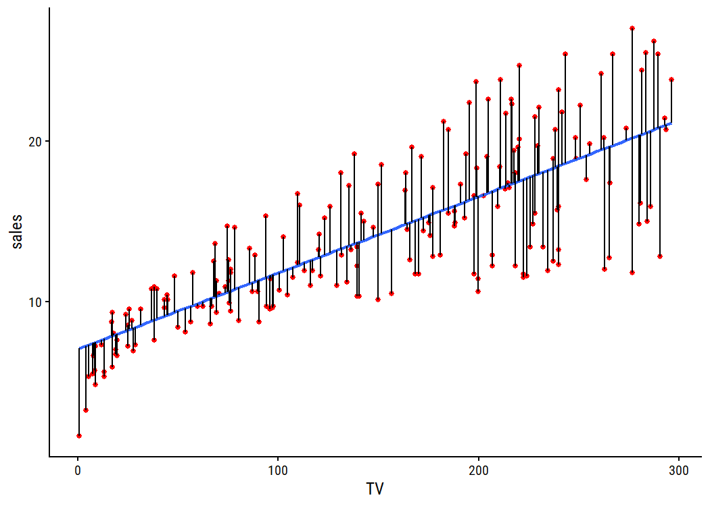<!-- -->

``` r
summary(lm_sales_tv)
```

    ## 
    ## Call:
    ## lm(formula = sales ~ TV, data = advertising)
    ## 
    ## Residuals:
    ##     Min      1Q  Median      3Q     Max 
    ## -8.3860 -1.9545 -0.1913  2.0671  7.2124 
    ## 
    ## Coefficients:
    ##             Estimate Std. Error t value Pr(>|t|)    
    ## (Intercept) 7.032594   0.457843   15.36   <2e-16 ***
    ## TV          0.047537   0.002691   17.67   <2e-16 ***
    ## ---
    ## Signif. codes:  0 '***' 0.001 '**' 0.01 '*' 0.05 '.' 0.1 ' ' 1
    ## 
    ## Residual standard error: 3.259 on 198 degrees of freedom
    ## Multiple R-squared:  0.6119, Adjusted R-squared:  0.6099 
    ## F-statistic: 312.1 on 1 and 198 DF,  p-value: < 2.2e-16

We recover the same regression coefficients: *β*<sub>0</sub> = 7.03 and
*β*<sub>1</sub> = 0.0475.

## 3.1.2 Assessing the Accuracy of the Coefficient Estimates

The quickest way to get the 95% confidence intervals for the
coefficients is with `stats::confint()`:

``` r
confint(lm_sales_tv)
```

    ##                  2.5 %     97.5 %
    ## (Intercept) 6.12971927 7.93546783
    ## TV          0.04223072 0.05284256

Computing them manually requires the standard errors of the
coefficients. For this, I prefer `broom::tidy`:

``` r
library(broom)
tidy(lm_sales_tv)
```

    ## # A tibble: 2 x 5
    ##   term        estimate std.error statistic  p.value
    ##   <chr>          <dbl>     <dbl>     <dbl>    <dbl>
    ## 1 (Intercept)   7.03     0.458        15.4 1.41e-35
    ## 2 TV            0.0475   0.00269      17.7 1.47e-42

Then double the SEs to approximate the intervals:

``` r
tidy(lm_sales_tv) %>%
  transmute(
    term, estimate,
    ci_lower = estimate - 2*std.error, ci_upper = estimate + 2*std.error
  )
```

    ## # A tibble: 2 x 4
    ##   term        estimate ci_lower ci_upper
    ##   <chr>          <dbl>    <dbl>    <dbl>
    ## 1 (Intercept)   7.03     6.12     7.95  
    ## 2 TV            0.0475   0.0422   0.0529

The *t*-statistics are returned by `broom::tidy` as the `statistic`
variable. We can manually compute them with the estimates and SEs, and
compute the *p*-value based on a *t*-distribution:

``` r
tidy(lm_sales_tv) %>%
  transmute(
    term, estimate, se = std.error,
    t = estimate / se,
    p_value = 2 * pt(-t, df = nrow(advertising) - 2)
  )
```

    ## # A tibble: 2 x 5
    ##   term        estimate      se     t  p_value
    ##   <chr>          <dbl>   <dbl> <dbl>    <dbl>
    ## 1 (Intercept)   7.03   0.458    15.4 1.41e-35
    ## 2 TV            0.0475 0.00269  17.7 1.47e-42

## 3.1.3 Assessing the Accuracy of the Model

The `broom::glance` function gives summary statistics of a model:

``` r
glance(lm_sales_tv)
```

    ## # A tibble: 1 x 12
    ##   r.squared adj.r.squared sigma statistic  p.value    df logLik   AIC   BIC
    ##       <dbl>         <dbl> <dbl>     <dbl>    <dbl> <dbl>  <dbl> <dbl> <dbl>
    ## 1     0.612         0.610  3.26      312. 1.47e-42     1  -519. 1044. 1054.
    ## # ... with 3 more variables: deviance <dbl>, df.residual <int>, nobs <int>

The residual standard error (RSE) is `sigma`, variance explained
*R*<sup>2</sup> is `r.squared`, and the *F*-statistic is `statistic`.
With this, we can re-create Table 3.2:

``` r
glance(lm_sales_tv) %>%
  transmute(`Residual standard error` = round(sigma, 2),
            `R2` = round(r.squared, 3), `F-statistic` = round(statistic, 1)) %>%
  mutate(across(everything(), as.character)) %>%
  pivot_longer(everything(), names_to = "Quantity", values_to = "Value") %>%
  gt()
```

<div id="sbnwexxkds" style="overflow-x:auto;overflow-y:auto;width:auto;height:auto;">
<style>html {
  font-family: -apple-system, BlinkMacSystemFont, 'Segoe UI', Roboto, Oxygen, Ubuntu, Cantarell, 'Helvetica Neue', 'Fira Sans', 'Droid Sans', Arial, sans-serif;
}

#sbnwexxkds .gt_table {
  display: table;
  border-collapse: collapse;
  margin-left: auto;
  margin-right: auto;
  color: #333333;
  font-size: 16px;
  font-weight: normal;
  font-style: normal;
  background-color: #FFFFFF;
  width: auto;
  border-top-style: solid;
  border-top-width: 2px;
  border-top-color: #A8A8A8;
  border-right-style: none;
  border-right-width: 2px;
  border-right-color: #D3D3D3;
  border-bottom-style: solid;
  border-bottom-width: 2px;
  border-bottom-color: #A8A8A8;
  border-left-style: none;
  border-left-width: 2px;
  border-left-color: #D3D3D3;
}

#sbnwexxkds .gt_heading {
  background-color: #FFFFFF;
  text-align: center;
  border-bottom-color: #FFFFFF;
  border-left-style: none;
  border-left-width: 1px;
  border-left-color: #D3D3D3;
  border-right-style: none;
  border-right-width: 1px;
  border-right-color: #D3D3D3;
}

#sbnwexxkds .gt_title {
  color: #333333;
  font-size: 125%;
  font-weight: initial;
  padding-top: 4px;
  padding-bottom: 4px;
  border-bottom-color: #FFFFFF;
  border-bottom-width: 0;
}

#sbnwexxkds .gt_subtitle {
  color: #333333;
  font-size: 85%;
  font-weight: initial;
  padding-top: 0;
  padding-bottom: 4px;
  border-top-color: #FFFFFF;
  border-top-width: 0;
}

#sbnwexxkds .gt_bottom_border {
  border-bottom-style: solid;
  border-bottom-width: 2px;
  border-bottom-color: #D3D3D3;
}

#sbnwexxkds .gt_col_headings {
  border-top-style: solid;
  border-top-width: 2px;
  border-top-color: #D3D3D3;
  border-bottom-style: solid;
  border-bottom-width: 2px;
  border-bottom-color: #D3D3D3;
  border-left-style: none;
  border-left-width: 1px;
  border-left-color: #D3D3D3;
  border-right-style: none;
  border-right-width: 1px;
  border-right-color: #D3D3D3;
}

#sbnwexxkds .gt_col_heading {
  color: #333333;
  background-color: #FFFFFF;
  font-size: 100%;
  font-weight: normal;
  text-transform: inherit;
  border-left-style: none;
  border-left-width: 1px;
  border-left-color: #D3D3D3;
  border-right-style: none;
  border-right-width: 1px;
  border-right-color: #D3D3D3;
  vertical-align: bottom;
  padding-top: 5px;
  padding-bottom: 6px;
  padding-left: 5px;
  padding-right: 5px;
  overflow-x: hidden;
}

#sbnwexxkds .gt_column_spanner_outer {
  color: #333333;
  background-color: #FFFFFF;
  font-size: 100%;
  font-weight: normal;
  text-transform: inherit;
  padding-top: 0;
  padding-bottom: 0;
  padding-left: 4px;
  padding-right: 4px;
}

#sbnwexxkds .gt_column_spanner_outer:first-child {
  padding-left: 0;
}

#sbnwexxkds .gt_column_spanner_outer:last-child {
  padding-right: 0;
}

#sbnwexxkds .gt_column_spanner {
  border-bottom-style: solid;
  border-bottom-width: 2px;
  border-bottom-color: #D3D3D3;
  vertical-align: bottom;
  padding-top: 5px;
  padding-bottom: 6px;
  overflow-x: hidden;
  display: inline-block;
  width: 100%;
}

#sbnwexxkds .gt_group_heading {
  padding: 8px;
  color: #333333;
  background-color: #FFFFFF;
  font-size: 100%;
  font-weight: initial;
  text-transform: inherit;
  border-top-style: solid;
  border-top-width: 2px;
  border-top-color: #D3D3D3;
  border-bottom-style: solid;
  border-bottom-width: 2px;
  border-bottom-color: #D3D3D3;
  border-left-style: none;
  border-left-width: 1px;
  border-left-color: #D3D3D3;
  border-right-style: none;
  border-right-width: 1px;
  border-right-color: #D3D3D3;
  vertical-align: middle;
}

#sbnwexxkds .gt_empty_group_heading {
  padding: 0.5px;
  color: #333333;
  background-color: #FFFFFF;
  font-size: 100%;
  font-weight: initial;
  border-top-style: solid;
  border-top-width: 2px;
  border-top-color: #D3D3D3;
  border-bottom-style: solid;
  border-bottom-width: 2px;
  border-bottom-color: #D3D3D3;
  vertical-align: middle;
}

#sbnwexxkds .gt_from_md > :first-child {
  margin-top: 0;
}

#sbnwexxkds .gt_from_md > :last-child {
  margin-bottom: 0;
}

#sbnwexxkds .gt_row {
  padding-top: 8px;
  padding-bottom: 8px;
  padding-left: 5px;
  padding-right: 5px;
  margin: 10px;
  border-top-style: solid;
  border-top-width: 1px;
  border-top-color: #D3D3D3;
  border-left-style: none;
  border-left-width: 1px;
  border-left-color: #D3D3D3;
  border-right-style: none;
  border-right-width: 1px;
  border-right-color: #D3D3D3;
  vertical-align: middle;
  overflow-x: hidden;
}

#sbnwexxkds .gt_stub {
  color: #333333;
  background-color: #FFFFFF;
  font-size: 100%;
  font-weight: initial;
  text-transform: inherit;
  border-right-style: solid;
  border-right-width: 2px;
  border-right-color: #D3D3D3;
  padding-left: 12px;
}

#sbnwexxkds .gt_summary_row {
  color: #333333;
  background-color: #FFFFFF;
  text-transform: inherit;
  padding-top: 8px;
  padding-bottom: 8px;
  padding-left: 5px;
  padding-right: 5px;
}

#sbnwexxkds .gt_first_summary_row {
  padding-top: 8px;
  padding-bottom: 8px;
  padding-left: 5px;
  padding-right: 5px;
  border-top-style: solid;
  border-top-width: 2px;
  border-top-color: #D3D3D3;
}

#sbnwexxkds .gt_grand_summary_row {
  color: #333333;
  background-color: #FFFFFF;
  text-transform: inherit;
  padding-top: 8px;
  padding-bottom: 8px;
  padding-left: 5px;
  padding-right: 5px;
}

#sbnwexxkds .gt_first_grand_summary_row {
  padding-top: 8px;
  padding-bottom: 8px;
  padding-left: 5px;
  padding-right: 5px;
  border-top-style: double;
  border-top-width: 6px;
  border-top-color: #D3D3D3;
}

#sbnwexxkds .gt_striped {
  background-color: rgba(128, 128, 128, 0.05);
}

#sbnwexxkds .gt_table_body {
  border-top-style: solid;
  border-top-width: 2px;
  border-top-color: #D3D3D3;
  border-bottom-style: solid;
  border-bottom-width: 2px;
  border-bottom-color: #D3D3D3;
}

#sbnwexxkds .gt_footnotes {
  color: #333333;
  background-color: #FFFFFF;
  border-bottom-style: none;
  border-bottom-width: 2px;
  border-bottom-color: #D3D3D3;
  border-left-style: none;
  border-left-width: 2px;
  border-left-color: #D3D3D3;
  border-right-style: none;
  border-right-width: 2px;
  border-right-color: #D3D3D3;
}

#sbnwexxkds .gt_footnote {
  margin: 0px;
  font-size: 90%;
  padding: 4px;
}

#sbnwexxkds .gt_sourcenotes {
  color: #333333;
  background-color: #FFFFFF;
  border-bottom-style: none;
  border-bottom-width: 2px;
  border-bottom-color: #D3D3D3;
  border-left-style: none;
  border-left-width: 2px;
  border-left-color: #D3D3D3;
  border-right-style: none;
  border-right-width: 2px;
  border-right-color: #D3D3D3;
}

#sbnwexxkds .gt_sourcenote {
  font-size: 90%;
  padding: 4px;
}

#sbnwexxkds .gt_left {
  text-align: left;
}

#sbnwexxkds .gt_center {
  text-align: center;
}

#sbnwexxkds .gt_right {
  text-align: right;
  font-variant-numeric: tabular-nums;
}

#sbnwexxkds .gt_font_normal {
  font-weight: normal;
}

#sbnwexxkds .gt_font_bold {
  font-weight: bold;
}

#sbnwexxkds .gt_font_italic {
  font-style: italic;
}

#sbnwexxkds .gt_super {
  font-size: 65%;
}

#sbnwexxkds .gt_footnote_marks {
  font-style: italic;
  font-weight: normal;
  font-size: 65%;
}
</style>
<table class="gt_table">
  
  <thead class="gt_col_headings">
    <tr>
      <th class="gt_col_heading gt_columns_bottom_border gt_left" rowspan="1" colspan="1">Quantity</th>
      <th class="gt_col_heading gt_columns_bottom_border gt_left" rowspan="1" colspan="1">Value</th>
    </tr>
  </thead>
  <tbody class="gt_table_body">
    <tr><td class="gt_row gt_left">Residual standard error</td>
<td class="gt_row gt_left">3.26</td></tr>
    <tr><td class="gt_row gt_left">R2</td>
<td class="gt_row gt_left">0.612</td></tr>
    <tr><td class="gt_row gt_left">F-statistic</td>
<td class="gt_row gt_left">312.1</td></tr>
  </tbody>
  
  
</table>
</div>

# 3.2 Multiple Linear Regression

Before performing the multiple linear regression, fit the other two
simple linear regression models on radio and newspaper budgets:

``` r
lm_sales_radio <- lm(sales ~ radio, data = advertising)
lm_sales_newspaper <- lm(sales ~ newspaper, data = advertising)
```

The `gtsummary` package provides functions to quickly create regression
summary tables, similar to Table 3.4:

``` r
library(gtsummary)
tbl_regression(lm_sales_radio, intercept = TRUE)
```

<div id="szlyrujmzt" style="overflow-x:auto;overflow-y:auto;width:auto;height:auto;">
<style>html {
  font-family: -apple-system, BlinkMacSystemFont, 'Segoe UI', Roboto, Oxygen, Ubuntu, Cantarell, 'Helvetica Neue', 'Fira Sans', 'Droid Sans', Arial, sans-serif;
}

#szlyrujmzt .gt_table {
  display: table;
  border-collapse: collapse;
  margin-left: auto;
  margin-right: auto;
  color: #333333;
  font-size: 16px;
  font-weight: normal;
  font-style: normal;
  background-color: #FFFFFF;
  width: auto;
  border-top-style: solid;
  border-top-width: 2px;
  border-top-color: #A8A8A8;
  border-right-style: none;
  border-right-width: 2px;
  border-right-color: #D3D3D3;
  border-bottom-style: solid;
  border-bottom-width: 2px;
  border-bottom-color: #A8A8A8;
  border-left-style: none;
  border-left-width: 2px;
  border-left-color: #D3D3D3;
}

#szlyrujmzt .gt_heading {
  background-color: #FFFFFF;
  text-align: center;
  border-bottom-color: #FFFFFF;
  border-left-style: none;
  border-left-width: 1px;
  border-left-color: #D3D3D3;
  border-right-style: none;
  border-right-width: 1px;
  border-right-color: #D3D3D3;
}

#szlyrujmzt .gt_title {
  color: #333333;
  font-size: 125%;
  font-weight: initial;
  padding-top: 4px;
  padding-bottom: 4px;
  border-bottom-color: #FFFFFF;
  border-bottom-width: 0;
}

#szlyrujmzt .gt_subtitle {
  color: #333333;
  font-size: 85%;
  font-weight: initial;
  padding-top: 0;
  padding-bottom: 4px;
  border-top-color: #FFFFFF;
  border-top-width: 0;
}

#szlyrujmzt .gt_bottom_border {
  border-bottom-style: solid;
  border-bottom-width: 2px;
  border-bottom-color: #D3D3D3;
}

#szlyrujmzt .gt_col_headings {
  border-top-style: solid;
  border-top-width: 2px;
  border-top-color: #D3D3D3;
  border-bottom-style: solid;
  border-bottom-width: 2px;
  border-bottom-color: #D3D3D3;
  border-left-style: none;
  border-left-width: 1px;
  border-left-color: #D3D3D3;
  border-right-style: none;
  border-right-width: 1px;
  border-right-color: #D3D3D3;
}

#szlyrujmzt .gt_col_heading {
  color: #333333;
  background-color: #FFFFFF;
  font-size: 100%;
  font-weight: normal;
  text-transform: inherit;
  border-left-style: none;
  border-left-width: 1px;
  border-left-color: #D3D3D3;
  border-right-style: none;
  border-right-width: 1px;
  border-right-color: #D3D3D3;
  vertical-align: bottom;
  padding-top: 5px;
  padding-bottom: 6px;
  padding-left: 5px;
  padding-right: 5px;
  overflow-x: hidden;
}

#szlyrujmzt .gt_column_spanner_outer {
  color: #333333;
  background-color: #FFFFFF;
  font-size: 100%;
  font-weight: normal;
  text-transform: inherit;
  padding-top: 0;
  padding-bottom: 0;
  padding-left: 4px;
  padding-right: 4px;
}

#szlyrujmzt .gt_column_spanner_outer:first-child {
  padding-left: 0;
}

#szlyrujmzt .gt_column_spanner_outer:last-child {
  padding-right: 0;
}

#szlyrujmzt .gt_column_spanner {
  border-bottom-style: solid;
  border-bottom-width: 2px;
  border-bottom-color: #D3D3D3;
  vertical-align: bottom;
  padding-top: 5px;
  padding-bottom: 6px;
  overflow-x: hidden;
  display: inline-block;
  width: 100%;
}

#szlyrujmzt .gt_group_heading {
  padding: 8px;
  color: #333333;
  background-color: #FFFFFF;
  font-size: 100%;
  font-weight: initial;
  text-transform: inherit;
  border-top-style: solid;
  border-top-width: 2px;
  border-top-color: #D3D3D3;
  border-bottom-style: solid;
  border-bottom-width: 2px;
  border-bottom-color: #D3D3D3;
  border-left-style: none;
  border-left-width: 1px;
  border-left-color: #D3D3D3;
  border-right-style: none;
  border-right-width: 1px;
  border-right-color: #D3D3D3;
  vertical-align: middle;
}

#szlyrujmzt .gt_empty_group_heading {
  padding: 0.5px;
  color: #333333;
  background-color: #FFFFFF;
  font-size: 100%;
  font-weight: initial;
  border-top-style: solid;
  border-top-width: 2px;
  border-top-color: #D3D3D3;
  border-bottom-style: solid;
  border-bottom-width: 2px;
  border-bottom-color: #D3D3D3;
  vertical-align: middle;
}

#szlyrujmzt .gt_from_md > :first-child {
  margin-top: 0;
}

#szlyrujmzt .gt_from_md > :last-child {
  margin-bottom: 0;
}

#szlyrujmzt .gt_row {
  padding-top: 8px;
  padding-bottom: 8px;
  padding-left: 5px;
  padding-right: 5px;
  margin: 10px;
  border-top-style: solid;
  border-top-width: 1px;
  border-top-color: #D3D3D3;
  border-left-style: none;
  border-left-width: 1px;
  border-left-color: #D3D3D3;
  border-right-style: none;
  border-right-width: 1px;
  border-right-color: #D3D3D3;
  vertical-align: middle;
  overflow-x: hidden;
}

#szlyrujmzt .gt_stub {
  color: #333333;
  background-color: #FFFFFF;
  font-size: 100%;
  font-weight: initial;
  text-transform: inherit;
  border-right-style: solid;
  border-right-width: 2px;
  border-right-color: #D3D3D3;
  padding-left: 12px;
}

#szlyrujmzt .gt_summary_row {
  color: #333333;
  background-color: #FFFFFF;
  text-transform: inherit;
  padding-top: 8px;
  padding-bottom: 8px;
  padding-left: 5px;
  padding-right: 5px;
}

#szlyrujmzt .gt_first_summary_row {
  padding-top: 8px;
  padding-bottom: 8px;
  padding-left: 5px;
  padding-right: 5px;
  border-top-style: solid;
  border-top-width: 2px;
  border-top-color: #D3D3D3;
}

#szlyrujmzt .gt_grand_summary_row {
  color: #333333;
  background-color: #FFFFFF;
  text-transform: inherit;
  padding-top: 8px;
  padding-bottom: 8px;
  padding-left: 5px;
  padding-right: 5px;
}

#szlyrujmzt .gt_first_grand_summary_row {
  padding-top: 8px;
  padding-bottom: 8px;
  padding-left: 5px;
  padding-right: 5px;
  border-top-style: double;
  border-top-width: 6px;
  border-top-color: #D3D3D3;
}

#szlyrujmzt .gt_striped {
  background-color: rgba(128, 128, 128, 0.05);
}

#szlyrujmzt .gt_table_body {
  border-top-style: solid;
  border-top-width: 2px;
  border-top-color: #D3D3D3;
  border-bottom-style: solid;
  border-bottom-width: 2px;
  border-bottom-color: #D3D3D3;
}

#szlyrujmzt .gt_footnotes {
  color: #333333;
  background-color: #FFFFFF;
  border-bottom-style: none;
  border-bottom-width: 2px;
  border-bottom-color: #D3D3D3;
  border-left-style: none;
  border-left-width: 2px;
  border-left-color: #D3D3D3;
  border-right-style: none;
  border-right-width: 2px;
  border-right-color: #D3D3D3;
}

#szlyrujmzt .gt_footnote {
  margin: 0px;
  font-size: 90%;
  padding: 4px;
}

#szlyrujmzt .gt_sourcenotes {
  color: #333333;
  background-color: #FFFFFF;
  border-bottom-style: none;
  border-bottom-width: 2px;
  border-bottom-color: #D3D3D3;
  border-left-style: none;
  border-left-width: 2px;
  border-left-color: #D3D3D3;
  border-right-style: none;
  border-right-width: 2px;
  border-right-color: #D3D3D3;
}

#szlyrujmzt .gt_sourcenote {
  font-size: 90%;
  padding: 4px;
}

#szlyrujmzt .gt_left {
  text-align: left;
}

#szlyrujmzt .gt_center {
  text-align: center;
}

#szlyrujmzt .gt_right {
  text-align: right;
  font-variant-numeric: tabular-nums;
}

#szlyrujmzt .gt_font_normal {
  font-weight: normal;
}

#szlyrujmzt .gt_font_bold {
  font-weight: bold;
}

#szlyrujmzt .gt_font_italic {
  font-style: italic;
}

#szlyrujmzt .gt_super {
  font-size: 65%;
}

#szlyrujmzt .gt_footnote_marks {
  font-style: italic;
  font-weight: normal;
  font-size: 65%;
}
</style>
<table class="gt_table">
  
  <thead class="gt_col_headings">
    <tr>
      <th class="gt_col_heading gt_columns_bottom_border gt_left" rowspan="1" colspan="1"><strong>Characteristic</strong></th>
      <th class="gt_col_heading gt_columns_bottom_border gt_center" rowspan="1" colspan="1"><strong>Beta</strong></th>
      <th class="gt_col_heading gt_columns_bottom_border gt_center" rowspan="1" colspan="1"><strong>95% CI</strong><sup class="gt_footnote_marks">1</sup></th>
      <th class="gt_col_heading gt_columns_bottom_border gt_center" rowspan="1" colspan="1"><strong>p-value</strong></th>
    </tr>
  </thead>
  <tbody class="gt_table_body">
    <tr><td class="gt_row gt_left">(Intercept)</td>
<td class="gt_row gt_center">9.3</td>
<td class="gt_row gt_center">8.2, 10</td>
<td class="gt_row gt_center"><0.001</td></tr>
    <tr><td class="gt_row gt_left">radio</td>
<td class="gt_row gt_center">0.20</td>
<td class="gt_row gt_center">0.16, 0.24</td>
<td class="gt_row gt_center"><0.001</td></tr>
  </tbody>
  
  <tfoot>
    <tr class="gt_footnotes">
      <td colspan="4">
        <p class="gt_footnote">
          <sup class="gt_footnote_marks">
            <em>1</em>
          </sup>
           
          CI = Confidence Interval
          <br />
        </p>
      </td>
    </tr>
  </tfoot>
</table>
</div>

``` r
tbl_regression(lm_sales_newspaper, intercept = TRUE)
```

<div id="zbwervuvqz" style="overflow-x:auto;overflow-y:auto;width:auto;height:auto;">
<style>html {
  font-family: -apple-system, BlinkMacSystemFont, 'Segoe UI', Roboto, Oxygen, Ubuntu, Cantarell, 'Helvetica Neue', 'Fira Sans', 'Droid Sans', Arial, sans-serif;
}

#zbwervuvqz .gt_table {
  display: table;
  border-collapse: collapse;
  margin-left: auto;
  margin-right: auto;
  color: #333333;
  font-size: 16px;
  font-weight: normal;
  font-style: normal;
  background-color: #FFFFFF;
  width: auto;
  border-top-style: solid;
  border-top-width: 2px;
  border-top-color: #A8A8A8;
  border-right-style: none;
  border-right-width: 2px;
  border-right-color: #D3D3D3;
  border-bottom-style: solid;
  border-bottom-width: 2px;
  border-bottom-color: #A8A8A8;
  border-left-style: none;
  border-left-width: 2px;
  border-left-color: #D3D3D3;
}

#zbwervuvqz .gt_heading {
  background-color: #FFFFFF;
  text-align: center;
  border-bottom-color: #FFFFFF;
  border-left-style: none;
  border-left-width: 1px;
  border-left-color: #D3D3D3;
  border-right-style: none;
  border-right-width: 1px;
  border-right-color: #D3D3D3;
}

#zbwervuvqz .gt_title {
  color: #333333;
  font-size: 125%;
  font-weight: initial;
  padding-top: 4px;
  padding-bottom: 4px;
  border-bottom-color: #FFFFFF;
  border-bottom-width: 0;
}

#zbwervuvqz .gt_subtitle {
  color: #333333;
  font-size: 85%;
  font-weight: initial;
  padding-top: 0;
  padding-bottom: 4px;
  border-top-color: #FFFFFF;
  border-top-width: 0;
}

#zbwervuvqz .gt_bottom_border {
  border-bottom-style: solid;
  border-bottom-width: 2px;
  border-bottom-color: #D3D3D3;
}

#zbwervuvqz .gt_col_headings {
  border-top-style: solid;
  border-top-width: 2px;
  border-top-color: #D3D3D3;
  border-bottom-style: solid;
  border-bottom-width: 2px;
  border-bottom-color: #D3D3D3;
  border-left-style: none;
  border-left-width: 1px;
  border-left-color: #D3D3D3;
  border-right-style: none;
  border-right-width: 1px;
  border-right-color: #D3D3D3;
}

#zbwervuvqz .gt_col_heading {
  color: #333333;
  background-color: #FFFFFF;
  font-size: 100%;
  font-weight: normal;
  text-transform: inherit;
  border-left-style: none;
  border-left-width: 1px;
  border-left-color: #D3D3D3;
  border-right-style: none;
  border-right-width: 1px;
  border-right-color: #D3D3D3;
  vertical-align: bottom;
  padding-top: 5px;
  padding-bottom: 6px;
  padding-left: 5px;
  padding-right: 5px;
  overflow-x: hidden;
}

#zbwervuvqz .gt_column_spanner_outer {
  color: #333333;
  background-color: #FFFFFF;
  font-size: 100%;
  font-weight: normal;
  text-transform: inherit;
  padding-top: 0;
  padding-bottom: 0;
  padding-left: 4px;
  padding-right: 4px;
}

#zbwervuvqz .gt_column_spanner_outer:first-child {
  padding-left: 0;
}

#zbwervuvqz .gt_column_spanner_outer:last-child {
  padding-right: 0;
}

#zbwervuvqz .gt_column_spanner {
  border-bottom-style: solid;
  border-bottom-width: 2px;
  border-bottom-color: #D3D3D3;
  vertical-align: bottom;
  padding-top: 5px;
  padding-bottom: 6px;
  overflow-x: hidden;
  display: inline-block;
  width: 100%;
}

#zbwervuvqz .gt_group_heading {
  padding: 8px;
  color: #333333;
  background-color: #FFFFFF;
  font-size: 100%;
  font-weight: initial;
  text-transform: inherit;
  border-top-style: solid;
  border-top-width: 2px;
  border-top-color: #D3D3D3;
  border-bottom-style: solid;
  border-bottom-width: 2px;
  border-bottom-color: #D3D3D3;
  border-left-style: none;
  border-left-width: 1px;
  border-left-color: #D3D3D3;
  border-right-style: none;
  border-right-width: 1px;
  border-right-color: #D3D3D3;
  vertical-align: middle;
}

#zbwervuvqz .gt_empty_group_heading {
  padding: 0.5px;
  color: #333333;
  background-color: #FFFFFF;
  font-size: 100%;
  font-weight: initial;
  border-top-style: solid;
  border-top-width: 2px;
  border-top-color: #D3D3D3;
  border-bottom-style: solid;
  border-bottom-width: 2px;
  border-bottom-color: #D3D3D3;
  vertical-align: middle;
}

#zbwervuvqz .gt_from_md > :first-child {
  margin-top: 0;
}

#zbwervuvqz .gt_from_md > :last-child {
  margin-bottom: 0;
}

#zbwervuvqz .gt_row {
  padding-top: 8px;
  padding-bottom: 8px;
  padding-left: 5px;
  padding-right: 5px;
  margin: 10px;
  border-top-style: solid;
  border-top-width: 1px;
  border-top-color: #D3D3D3;
  border-left-style: none;
  border-left-width: 1px;
  border-left-color: #D3D3D3;
  border-right-style: none;
  border-right-width: 1px;
  border-right-color: #D3D3D3;
  vertical-align: middle;
  overflow-x: hidden;
}

#zbwervuvqz .gt_stub {
  color: #333333;
  background-color: #FFFFFF;
  font-size: 100%;
  font-weight: initial;
  text-transform: inherit;
  border-right-style: solid;
  border-right-width: 2px;
  border-right-color: #D3D3D3;
  padding-left: 12px;
}

#zbwervuvqz .gt_summary_row {
  color: #333333;
  background-color: #FFFFFF;
  text-transform: inherit;
  padding-top: 8px;
  padding-bottom: 8px;
  padding-left: 5px;
  padding-right: 5px;
}

#zbwervuvqz .gt_first_summary_row {
  padding-top: 8px;
  padding-bottom: 8px;
  padding-left: 5px;
  padding-right: 5px;
  border-top-style: solid;
  border-top-width: 2px;
  border-top-color: #D3D3D3;
}

#zbwervuvqz .gt_grand_summary_row {
  color: #333333;
  background-color: #FFFFFF;
  text-transform: inherit;
  padding-top: 8px;
  padding-bottom: 8px;
  padding-left: 5px;
  padding-right: 5px;
}

#zbwervuvqz .gt_first_grand_summary_row {
  padding-top: 8px;
  padding-bottom: 8px;
  padding-left: 5px;
  padding-right: 5px;
  border-top-style: double;
  border-top-width: 6px;
  border-top-color: #D3D3D3;
}

#zbwervuvqz .gt_striped {
  background-color: rgba(128, 128, 128, 0.05);
}

#zbwervuvqz .gt_table_body {
  border-top-style: solid;
  border-top-width: 2px;
  border-top-color: #D3D3D3;
  border-bottom-style: solid;
  border-bottom-width: 2px;
  border-bottom-color: #D3D3D3;
}

#zbwervuvqz .gt_footnotes {
  color: #333333;
  background-color: #FFFFFF;
  border-bottom-style: none;
  border-bottom-width: 2px;
  border-bottom-color: #D3D3D3;
  border-left-style: none;
  border-left-width: 2px;
  border-left-color: #D3D3D3;
  border-right-style: none;
  border-right-width: 2px;
  border-right-color: #D3D3D3;
}

#zbwervuvqz .gt_footnote {
  margin: 0px;
  font-size: 90%;
  padding: 4px;
}

#zbwervuvqz .gt_sourcenotes {
  color: #333333;
  background-color: #FFFFFF;
  border-bottom-style: none;
  border-bottom-width: 2px;
  border-bottom-color: #D3D3D3;
  border-left-style: none;
  border-left-width: 2px;
  border-left-color: #D3D3D3;
  border-right-style: none;
  border-right-width: 2px;
  border-right-color: #D3D3D3;
}

#zbwervuvqz .gt_sourcenote {
  font-size: 90%;
  padding: 4px;
}

#zbwervuvqz .gt_left {
  text-align: left;
}

#zbwervuvqz .gt_center {
  text-align: center;
}

#zbwervuvqz .gt_right {
  text-align: right;
  font-variant-numeric: tabular-nums;
}

#zbwervuvqz .gt_font_normal {
  font-weight: normal;
}

#zbwervuvqz .gt_font_bold {
  font-weight: bold;
}

#zbwervuvqz .gt_font_italic {
  font-style: italic;
}

#zbwervuvqz .gt_super {
  font-size: 65%;
}

#zbwervuvqz .gt_footnote_marks {
  font-style: italic;
  font-weight: normal;
  font-size: 65%;
}
</style>
<table class="gt_table">
  
  <thead class="gt_col_headings">
    <tr>
      <th class="gt_col_heading gt_columns_bottom_border gt_left" rowspan="1" colspan="1"><strong>Characteristic</strong></th>
      <th class="gt_col_heading gt_columns_bottom_border gt_center" rowspan="1" colspan="1"><strong>Beta</strong></th>
      <th class="gt_col_heading gt_columns_bottom_border gt_center" rowspan="1" colspan="1"><strong>95% CI</strong><sup class="gt_footnote_marks">1</sup></th>
      <th class="gt_col_heading gt_columns_bottom_border gt_center" rowspan="1" colspan="1"><strong>p-value</strong></th>
    </tr>
  </thead>
  <tbody class="gt_table_body">
    <tr><td class="gt_row gt_left">(Intercept)</td>
<td class="gt_row gt_center">12</td>
<td class="gt_row gt_center">11, 14</td>
<td class="gt_row gt_center"><0.001</td></tr>
    <tr><td class="gt_row gt_left">newspaper</td>
<td class="gt_row gt_center">0.05</td>
<td class="gt_row gt_center">0.02, 0.09</td>
<td class="gt_row gt_center">0.001</td></tr>
  </tbody>
  
  <tfoot>
    <tr class="gt_footnotes">
      <td colspan="4">
        <p class="gt_footnote">
          <sup class="gt_footnote_marks">
            <em>1</em>
          </sup>
           
          CI = Confidence Interval
          <br />
        </p>
      </td>
    </tr>
  </tfoot>
</table>
</div>

Now fit the multiple regression model:

``` r
lm_sales_mult <- lm(sales ~ TV + radio + newspaper, data = advertising)
tbl_regression(lm_sales_mult, intercept = TRUE)
```

<div id="zykiglyeja" style="overflow-x:auto;overflow-y:auto;width:auto;height:auto;">
<style>html {
  font-family: -apple-system, BlinkMacSystemFont, 'Segoe UI', Roboto, Oxygen, Ubuntu, Cantarell, 'Helvetica Neue', 'Fira Sans', 'Droid Sans', Arial, sans-serif;
}

#zykiglyeja .gt_table {
  display: table;
  border-collapse: collapse;
  margin-left: auto;
  margin-right: auto;
  color: #333333;
  font-size: 16px;
  font-weight: normal;
  font-style: normal;
  background-color: #FFFFFF;
  width: auto;
  border-top-style: solid;
  border-top-width: 2px;
  border-top-color: #A8A8A8;
  border-right-style: none;
  border-right-width: 2px;
  border-right-color: #D3D3D3;
  border-bottom-style: solid;
  border-bottom-width: 2px;
  border-bottom-color: #A8A8A8;
  border-left-style: none;
  border-left-width: 2px;
  border-left-color: #D3D3D3;
}

#zykiglyeja .gt_heading {
  background-color: #FFFFFF;
  text-align: center;
  border-bottom-color: #FFFFFF;
  border-left-style: none;
  border-left-width: 1px;
  border-left-color: #D3D3D3;
  border-right-style: none;
  border-right-width: 1px;
  border-right-color: #D3D3D3;
}

#zykiglyeja .gt_title {
  color: #333333;
  font-size: 125%;
  font-weight: initial;
  padding-top: 4px;
  padding-bottom: 4px;
  border-bottom-color: #FFFFFF;
  border-bottom-width: 0;
}

#zykiglyeja .gt_subtitle {
  color: #333333;
  font-size: 85%;
  font-weight: initial;
  padding-top: 0;
  padding-bottom: 4px;
  border-top-color: #FFFFFF;
  border-top-width: 0;
}

#zykiglyeja .gt_bottom_border {
  border-bottom-style: solid;
  border-bottom-width: 2px;
  border-bottom-color: #D3D3D3;
}

#zykiglyeja .gt_col_headings {
  border-top-style: solid;
  border-top-width: 2px;
  border-top-color: #D3D3D3;
  border-bottom-style: solid;
  border-bottom-width: 2px;
  border-bottom-color: #D3D3D3;
  border-left-style: none;
  border-left-width: 1px;
  border-left-color: #D3D3D3;
  border-right-style: none;
  border-right-width: 1px;
  border-right-color: #D3D3D3;
}

#zykiglyeja .gt_col_heading {
  color: #333333;
  background-color: #FFFFFF;
  font-size: 100%;
  font-weight: normal;
  text-transform: inherit;
  border-left-style: none;
  border-left-width: 1px;
  border-left-color: #D3D3D3;
  border-right-style: none;
  border-right-width: 1px;
  border-right-color: #D3D3D3;
  vertical-align: bottom;
  padding-top: 5px;
  padding-bottom: 6px;
  padding-left: 5px;
  padding-right: 5px;
  overflow-x: hidden;
}

#zykiglyeja .gt_column_spanner_outer {
  color: #333333;
  background-color: #FFFFFF;
  font-size: 100%;
  font-weight: normal;
  text-transform: inherit;
  padding-top: 0;
  padding-bottom: 0;
  padding-left: 4px;
  padding-right: 4px;
}

#zykiglyeja .gt_column_spanner_outer:first-child {
  padding-left: 0;
}

#zykiglyeja .gt_column_spanner_outer:last-child {
  padding-right: 0;
}

#zykiglyeja .gt_column_spanner {
  border-bottom-style: solid;
  border-bottom-width: 2px;
  border-bottom-color: #D3D3D3;
  vertical-align: bottom;
  padding-top: 5px;
  padding-bottom: 6px;
  overflow-x: hidden;
  display: inline-block;
  width: 100%;
}

#zykiglyeja .gt_group_heading {
  padding: 8px;
  color: #333333;
  background-color: #FFFFFF;
  font-size: 100%;
  font-weight: initial;
  text-transform: inherit;
  border-top-style: solid;
  border-top-width: 2px;
  border-top-color: #D3D3D3;
  border-bottom-style: solid;
  border-bottom-width: 2px;
  border-bottom-color: #D3D3D3;
  border-left-style: none;
  border-left-width: 1px;
  border-left-color: #D3D3D3;
  border-right-style: none;
  border-right-width: 1px;
  border-right-color: #D3D3D3;
  vertical-align: middle;
}

#zykiglyeja .gt_empty_group_heading {
  padding: 0.5px;
  color: #333333;
  background-color: #FFFFFF;
  font-size: 100%;
  font-weight: initial;
  border-top-style: solid;
  border-top-width: 2px;
  border-top-color: #D3D3D3;
  border-bottom-style: solid;
  border-bottom-width: 2px;
  border-bottom-color: #D3D3D3;
  vertical-align: middle;
}

#zykiglyeja .gt_from_md > :first-child {
  margin-top: 0;
}

#zykiglyeja .gt_from_md > :last-child {
  margin-bottom: 0;
}

#zykiglyeja .gt_row {
  padding-top: 8px;
  padding-bottom: 8px;
  padding-left: 5px;
  padding-right: 5px;
  margin: 10px;
  border-top-style: solid;
  border-top-width: 1px;
  border-top-color: #D3D3D3;
  border-left-style: none;
  border-left-width: 1px;
  border-left-color: #D3D3D3;
  border-right-style: none;
  border-right-width: 1px;
  border-right-color: #D3D3D3;
  vertical-align: middle;
  overflow-x: hidden;
}

#zykiglyeja .gt_stub {
  color: #333333;
  background-color: #FFFFFF;
  font-size: 100%;
  font-weight: initial;
  text-transform: inherit;
  border-right-style: solid;
  border-right-width: 2px;
  border-right-color: #D3D3D3;
  padding-left: 12px;
}

#zykiglyeja .gt_summary_row {
  color: #333333;
  background-color: #FFFFFF;
  text-transform: inherit;
  padding-top: 8px;
  padding-bottom: 8px;
  padding-left: 5px;
  padding-right: 5px;
}

#zykiglyeja .gt_first_summary_row {
  padding-top: 8px;
  padding-bottom: 8px;
  padding-left: 5px;
  padding-right: 5px;
  border-top-style: solid;
  border-top-width: 2px;
  border-top-color: #D3D3D3;
}

#zykiglyeja .gt_grand_summary_row {
  color: #333333;
  background-color: #FFFFFF;
  text-transform: inherit;
  padding-top: 8px;
  padding-bottom: 8px;
  padding-left: 5px;
  padding-right: 5px;
}

#zykiglyeja .gt_first_grand_summary_row {
  padding-top: 8px;
  padding-bottom: 8px;
  padding-left: 5px;
  padding-right: 5px;
  border-top-style: double;
  border-top-width: 6px;
  border-top-color: #D3D3D3;
}

#zykiglyeja .gt_striped {
  background-color: rgba(128, 128, 128, 0.05);
}

#zykiglyeja .gt_table_body {
  border-top-style: solid;
  border-top-width: 2px;
  border-top-color: #D3D3D3;
  border-bottom-style: solid;
  border-bottom-width: 2px;
  border-bottom-color: #D3D3D3;
}

#zykiglyeja .gt_footnotes {
  color: #333333;
  background-color: #FFFFFF;
  border-bottom-style: none;
  border-bottom-width: 2px;
  border-bottom-color: #D3D3D3;
  border-left-style: none;
  border-left-width: 2px;
  border-left-color: #D3D3D3;
  border-right-style: none;
  border-right-width: 2px;
  border-right-color: #D3D3D3;
}

#zykiglyeja .gt_footnote {
  margin: 0px;
  font-size: 90%;
  padding: 4px;
}

#zykiglyeja .gt_sourcenotes {
  color: #333333;
  background-color: #FFFFFF;
  border-bottom-style: none;
  border-bottom-width: 2px;
  border-bottom-color: #D3D3D3;
  border-left-style: none;
  border-left-width: 2px;
  border-left-color: #D3D3D3;
  border-right-style: none;
  border-right-width: 2px;
  border-right-color: #D3D3D3;
}

#zykiglyeja .gt_sourcenote {
  font-size: 90%;
  padding: 4px;
}

#zykiglyeja .gt_left {
  text-align: left;
}

#zykiglyeja .gt_center {
  text-align: center;
}

#zykiglyeja .gt_right {
  text-align: right;
  font-variant-numeric: tabular-nums;
}

#zykiglyeja .gt_font_normal {
  font-weight: normal;
}

#zykiglyeja .gt_font_bold {
  font-weight: bold;
}

#zykiglyeja .gt_font_italic {
  font-style: italic;
}

#zykiglyeja .gt_super {
  font-size: 65%;
}

#zykiglyeja .gt_footnote_marks {
  font-style: italic;
  font-weight: normal;
  font-size: 65%;
}
</style>
<table class="gt_table">
  
  <thead class="gt_col_headings">
    <tr>
      <th class="gt_col_heading gt_columns_bottom_border gt_left" rowspan="1" colspan="1"><strong>Characteristic</strong></th>
      <th class="gt_col_heading gt_columns_bottom_border gt_center" rowspan="1" colspan="1"><strong>Beta</strong></th>
      <th class="gt_col_heading gt_columns_bottom_border gt_center" rowspan="1" colspan="1"><strong>95% CI</strong><sup class="gt_footnote_marks">1</sup></th>
      <th class="gt_col_heading gt_columns_bottom_border gt_center" rowspan="1" colspan="1"><strong>p-value</strong></th>
    </tr>
  </thead>
  <tbody class="gt_table_body">
    <tr><td class="gt_row gt_left">(Intercept)</td>
<td class="gt_row gt_center">2.9</td>
<td class="gt_row gt_center">2.3, 3.6</td>
<td class="gt_row gt_center"><0.001</td></tr>
    <tr><td class="gt_row gt_left">TV</td>
<td class="gt_row gt_center">0.05</td>
<td class="gt_row gt_center">0.04, 0.05</td>
<td class="gt_row gt_center"><0.001</td></tr>
    <tr><td class="gt_row gt_left">radio</td>
<td class="gt_row gt_center">0.19</td>
<td class="gt_row gt_center">0.17, 0.21</td>
<td class="gt_row gt_center"><0.001</td></tr>
    <tr><td class="gt_row gt_left">newspaper</td>
<td class="gt_row gt_center">0.00</td>
<td class="gt_row gt_center">-0.01, 0.01</td>
<td class="gt_row gt_center">0.9</td></tr>
  </tbody>
  
  <tfoot>
    <tr class="gt_footnotes">
      <td colspan="4">
        <p class="gt_footnote">
          <sup class="gt_footnote_marks">
            <em>1</em>
          </sup>
           
          CI = Confidence Interval
          <br />
        </p>
      </td>
    </tr>
  </tfoot>
</table>
</div>

The lack of association between sales and newspaper advertising can be
explained by co-linearity with the other predictors, as shown in Table
3.5:

``` r
advertising %>%
  pivot_longer(cols = -X1) %>%
  full_join(., ., by = "X1") %>%
  group_by(name.x, name.y) %>%
  summarise(
    corr_coef = cor(value.x, value.y) %>%
      round(4) %>%
      as.character(),
    .groups = "drop"
  ) %>%
  pivot_wider(names_from = name.y, values_from = corr_coef) %>%
  gt(rowname_col = "name.x")
```

<div id="azpttlplok" style="overflow-x:auto;overflow-y:auto;width:auto;height:auto;">
<style>html {
  font-family: -apple-system, BlinkMacSystemFont, 'Segoe UI', Roboto, Oxygen, Ubuntu, Cantarell, 'Helvetica Neue', 'Fira Sans', 'Droid Sans', Arial, sans-serif;
}

#azpttlplok .gt_table {
  display: table;
  border-collapse: collapse;
  margin-left: auto;
  margin-right: auto;
  color: #333333;
  font-size: 16px;
  font-weight: normal;
  font-style: normal;
  background-color: #FFFFFF;
  width: auto;
  border-top-style: solid;
  border-top-width: 2px;
  border-top-color: #A8A8A8;
  border-right-style: none;
  border-right-width: 2px;
  border-right-color: #D3D3D3;
  border-bottom-style: solid;
  border-bottom-width: 2px;
  border-bottom-color: #A8A8A8;
  border-left-style: none;
  border-left-width: 2px;
  border-left-color: #D3D3D3;
}

#azpttlplok .gt_heading {
  background-color: #FFFFFF;
  text-align: center;
  border-bottom-color: #FFFFFF;
  border-left-style: none;
  border-left-width: 1px;
  border-left-color: #D3D3D3;
  border-right-style: none;
  border-right-width: 1px;
  border-right-color: #D3D3D3;
}

#azpttlplok .gt_title {
  color: #333333;
  font-size: 125%;
  font-weight: initial;
  padding-top: 4px;
  padding-bottom: 4px;
  border-bottom-color: #FFFFFF;
  border-bottom-width: 0;
}

#azpttlplok .gt_subtitle {
  color: #333333;
  font-size: 85%;
  font-weight: initial;
  padding-top: 0;
  padding-bottom: 4px;
  border-top-color: #FFFFFF;
  border-top-width: 0;
}

#azpttlplok .gt_bottom_border {
  border-bottom-style: solid;
  border-bottom-width: 2px;
  border-bottom-color: #D3D3D3;
}

#azpttlplok .gt_col_headings {
  border-top-style: solid;
  border-top-width: 2px;
  border-top-color: #D3D3D3;
  border-bottom-style: solid;
  border-bottom-width: 2px;
  border-bottom-color: #D3D3D3;
  border-left-style: none;
  border-left-width: 1px;
  border-left-color: #D3D3D3;
  border-right-style: none;
  border-right-width: 1px;
  border-right-color: #D3D3D3;
}

#azpttlplok .gt_col_heading {
  color: #333333;
  background-color: #FFFFFF;
  font-size: 100%;
  font-weight: normal;
  text-transform: inherit;
  border-left-style: none;
  border-left-width: 1px;
  border-left-color: #D3D3D3;
  border-right-style: none;
  border-right-width: 1px;
  border-right-color: #D3D3D3;
  vertical-align: bottom;
  padding-top: 5px;
  padding-bottom: 6px;
  padding-left: 5px;
  padding-right: 5px;
  overflow-x: hidden;
}

#azpttlplok .gt_column_spanner_outer {
  color: #333333;
  background-color: #FFFFFF;
  font-size: 100%;
  font-weight: normal;
  text-transform: inherit;
  padding-top: 0;
  padding-bottom: 0;
  padding-left: 4px;
  padding-right: 4px;
}

#azpttlplok .gt_column_spanner_outer:first-child {
  padding-left: 0;
}

#azpttlplok .gt_column_spanner_outer:last-child {
  padding-right: 0;
}

#azpttlplok .gt_column_spanner {
  border-bottom-style: solid;
  border-bottom-width: 2px;
  border-bottom-color: #D3D3D3;
  vertical-align: bottom;
  padding-top: 5px;
  padding-bottom: 6px;
  overflow-x: hidden;
  display: inline-block;
  width: 100%;
}

#azpttlplok .gt_group_heading {
  padding: 8px;
  color: #333333;
  background-color: #FFFFFF;
  font-size: 100%;
  font-weight: initial;
  text-transform: inherit;
  border-top-style: solid;
  border-top-width: 2px;
  border-top-color: #D3D3D3;
  border-bottom-style: solid;
  border-bottom-width: 2px;
  border-bottom-color: #D3D3D3;
  border-left-style: none;
  border-left-width: 1px;
  border-left-color: #D3D3D3;
  border-right-style: none;
  border-right-width: 1px;
  border-right-color: #D3D3D3;
  vertical-align: middle;
}

#azpttlplok .gt_empty_group_heading {
  padding: 0.5px;
  color: #333333;
  background-color: #FFFFFF;
  font-size: 100%;
  font-weight: initial;
  border-top-style: solid;
  border-top-width: 2px;
  border-top-color: #D3D3D3;
  border-bottom-style: solid;
  border-bottom-width: 2px;
  border-bottom-color: #D3D3D3;
  vertical-align: middle;
}

#azpttlplok .gt_from_md > :first-child {
  margin-top: 0;
}

#azpttlplok .gt_from_md > :last-child {
  margin-bottom: 0;
}

#azpttlplok .gt_row {
  padding-top: 8px;
  padding-bottom: 8px;
  padding-left: 5px;
  padding-right: 5px;
  margin: 10px;
  border-top-style: solid;
  border-top-width: 1px;
  border-top-color: #D3D3D3;
  border-left-style: none;
  border-left-width: 1px;
  border-left-color: #D3D3D3;
  border-right-style: none;
  border-right-width: 1px;
  border-right-color: #D3D3D3;
  vertical-align: middle;
  overflow-x: hidden;
}

#azpttlplok .gt_stub {
  color: #333333;
  background-color: #FFFFFF;
  font-size: 100%;
  font-weight: initial;
  text-transform: inherit;
  border-right-style: solid;
  border-right-width: 2px;
  border-right-color: #D3D3D3;
  padding-left: 12px;
}

#azpttlplok .gt_summary_row {
  color: #333333;
  background-color: #FFFFFF;
  text-transform: inherit;
  padding-top: 8px;
  padding-bottom: 8px;
  padding-left: 5px;
  padding-right: 5px;
}

#azpttlplok .gt_first_summary_row {
  padding-top: 8px;
  padding-bottom: 8px;
  padding-left: 5px;
  padding-right: 5px;
  border-top-style: solid;
  border-top-width: 2px;
  border-top-color: #D3D3D3;
}

#azpttlplok .gt_grand_summary_row {
  color: #333333;
  background-color: #FFFFFF;
  text-transform: inherit;
  padding-top: 8px;
  padding-bottom: 8px;
  padding-left: 5px;
  padding-right: 5px;
}

#azpttlplok .gt_first_grand_summary_row {
  padding-top: 8px;
  padding-bottom: 8px;
  padding-left: 5px;
  padding-right: 5px;
  border-top-style: double;
  border-top-width: 6px;
  border-top-color: #D3D3D3;
}

#azpttlplok .gt_striped {
  background-color: rgba(128, 128, 128, 0.05);
}

#azpttlplok .gt_table_body {
  border-top-style: solid;
  border-top-width: 2px;
  border-top-color: #D3D3D3;
  border-bottom-style: solid;
  border-bottom-width: 2px;
  border-bottom-color: #D3D3D3;
}

#azpttlplok .gt_footnotes {
  color: #333333;
  background-color: #FFFFFF;
  border-bottom-style: none;
  border-bottom-width: 2px;
  border-bottom-color: #D3D3D3;
  border-left-style: none;
  border-left-width: 2px;
  border-left-color: #D3D3D3;
  border-right-style: none;
  border-right-width: 2px;
  border-right-color: #D3D3D3;
}

#azpttlplok .gt_footnote {
  margin: 0px;
  font-size: 90%;
  padding: 4px;
}

#azpttlplok .gt_sourcenotes {
  color: #333333;
  background-color: #FFFFFF;
  border-bottom-style: none;
  border-bottom-width: 2px;
  border-bottom-color: #D3D3D3;
  border-left-style: none;
  border-left-width: 2px;
  border-left-color: #D3D3D3;
  border-right-style: none;
  border-right-width: 2px;
  border-right-color: #D3D3D3;
}

#azpttlplok .gt_sourcenote {
  font-size: 90%;
  padding: 4px;
}

#azpttlplok .gt_left {
  text-align: left;
}

#azpttlplok .gt_center {
  text-align: center;
}

#azpttlplok .gt_right {
  text-align: right;
  font-variant-numeric: tabular-nums;
}

#azpttlplok .gt_font_normal {
  font-weight: normal;
}

#azpttlplok .gt_font_bold {
  font-weight: bold;
}

#azpttlplok .gt_font_italic {
  font-style: italic;
}

#azpttlplok .gt_super {
  font-size: 65%;
}

#azpttlplok .gt_footnote_marks {
  font-style: italic;
  font-weight: normal;
  font-size: 65%;
}
</style>
<table class="gt_table">
  
  <thead class="gt_col_headings">
    <tr>
      <th class="gt_col_heading gt_columns_bottom_border gt_left" rowspan="1" colspan="1"></th>
      <th class="gt_col_heading gt_columns_bottom_border gt_left" rowspan="1" colspan="1">newspaper</th>
      <th class="gt_col_heading gt_columns_bottom_border gt_left" rowspan="1" colspan="1">radio</th>
      <th class="gt_col_heading gt_columns_bottom_border gt_left" rowspan="1" colspan="1">sales</th>
      <th class="gt_col_heading gt_columns_bottom_border gt_left" rowspan="1" colspan="1">TV</th>
    </tr>
  </thead>
  <tbody class="gt_table_body">
    <tr><td class="gt_row gt_left gt_stub">newspaper</td>
<td class="gt_row gt_left">1</td>
<td class="gt_row gt_left">0.3541</td>
<td class="gt_row gt_left">0.2283</td>
<td class="gt_row gt_left">0.0566</td></tr>
    <tr><td class="gt_row gt_left gt_stub">radio</td>
<td class="gt_row gt_left">0.3541</td>
<td class="gt_row gt_left">1</td>
<td class="gt_row gt_left">0.5762</td>
<td class="gt_row gt_left">0.0548</td></tr>
    <tr><td class="gt_row gt_left gt_stub">sales</td>
<td class="gt_row gt_left">0.2283</td>
<td class="gt_row gt_left">0.5762</td>
<td class="gt_row gt_left">1</td>
<td class="gt_row gt_left">0.7822</td></tr>
    <tr><td class="gt_row gt_left gt_stub">TV</td>
<td class="gt_row gt_left">0.0566</td>
<td class="gt_row gt_left">0.0548</td>
<td class="gt_row gt_left">0.7822</td>
<td class="gt_row gt_left">1</td></tr>
  </tbody>
  
  
</table>
</div>

Consider the hypothesis test:

$$
\\begin{align}
H\_0:& \\beta\_1 = \\beta\_2 = \\dots = \\beta\_p = 0 \\\\
H\_a:& \\text{at least one of } \\beta\_j \\text{ is non-zero.}
\\end{align}
$$
This is performed by computing the *F*-statistic as in equation (3.23).
Instead of computing manually, we again use `broom::glance` to re-create
Table 3.6:

``` r
glance(lm_sales_mult) %>%
  transmute(`Residual standard error` = round(sigma, 2),
            `R2` = round(r.squared, 3), `F-statistic` = round(statistic, 1)) %>%
  mutate(across(everything(), as.character)) %>%
  pivot_longer(everything(), names_to = "Quantity", values_to = "Value") %>%
  gt()
```

<div id="wwfkdfixso" style="overflow-x:auto;overflow-y:auto;width:auto;height:auto;">
<style>html {
  font-family: -apple-system, BlinkMacSystemFont, 'Segoe UI', Roboto, Oxygen, Ubuntu, Cantarell, 'Helvetica Neue', 'Fira Sans', 'Droid Sans', Arial, sans-serif;
}

#wwfkdfixso .gt_table {
  display: table;
  border-collapse: collapse;
  margin-left: auto;
  margin-right: auto;
  color: #333333;
  font-size: 16px;
  font-weight: normal;
  font-style: normal;
  background-color: #FFFFFF;
  width: auto;
  border-top-style: solid;
  border-top-width: 2px;
  border-top-color: #A8A8A8;
  border-right-style: none;
  border-right-width: 2px;
  border-right-color: #D3D3D3;
  border-bottom-style: solid;
  border-bottom-width: 2px;
  border-bottom-color: #A8A8A8;
  border-left-style: none;
  border-left-width: 2px;
  border-left-color: #D3D3D3;
}

#wwfkdfixso .gt_heading {
  background-color: #FFFFFF;
  text-align: center;
  border-bottom-color: #FFFFFF;
  border-left-style: none;
  border-left-width: 1px;
  border-left-color: #D3D3D3;
  border-right-style: none;
  border-right-width: 1px;
  border-right-color: #D3D3D3;
}

#wwfkdfixso .gt_title {
  color: #333333;
  font-size: 125%;
  font-weight: initial;
  padding-top: 4px;
  padding-bottom: 4px;
  border-bottom-color: #FFFFFF;
  border-bottom-width: 0;
}

#wwfkdfixso .gt_subtitle {
  color: #333333;
  font-size: 85%;
  font-weight: initial;
  padding-top: 0;
  padding-bottom: 4px;
  border-top-color: #FFFFFF;
  border-top-width: 0;
}

#wwfkdfixso .gt_bottom_border {
  border-bottom-style: solid;
  border-bottom-width: 2px;
  border-bottom-color: #D3D3D3;
}

#wwfkdfixso .gt_col_headings {
  border-top-style: solid;
  border-top-width: 2px;
  border-top-color: #D3D3D3;
  border-bottom-style: solid;
  border-bottom-width: 2px;
  border-bottom-color: #D3D3D3;
  border-left-style: none;
  border-left-width: 1px;
  border-left-color: #D3D3D3;
  border-right-style: none;
  border-right-width: 1px;
  border-right-color: #D3D3D3;
}

#wwfkdfixso .gt_col_heading {
  color: #333333;
  background-color: #FFFFFF;
  font-size: 100%;
  font-weight: normal;
  text-transform: inherit;
  border-left-style: none;
  border-left-width: 1px;
  border-left-color: #D3D3D3;
  border-right-style: none;
  border-right-width: 1px;
  border-right-color: #D3D3D3;
  vertical-align: bottom;
  padding-top: 5px;
  padding-bottom: 6px;
  padding-left: 5px;
  padding-right: 5px;
  overflow-x: hidden;
}

#wwfkdfixso .gt_column_spanner_outer {
  color: #333333;
  background-color: #FFFFFF;
  font-size: 100%;
  font-weight: normal;
  text-transform: inherit;
  padding-top: 0;
  padding-bottom: 0;
  padding-left: 4px;
  padding-right: 4px;
}

#wwfkdfixso .gt_column_spanner_outer:first-child {
  padding-left: 0;
}

#wwfkdfixso .gt_column_spanner_outer:last-child {
  padding-right: 0;
}

#wwfkdfixso .gt_column_spanner {
  border-bottom-style: solid;
  border-bottom-width: 2px;
  border-bottom-color: #D3D3D3;
  vertical-align: bottom;
  padding-top: 5px;
  padding-bottom: 6px;
  overflow-x: hidden;
  display: inline-block;
  width: 100%;
}

#wwfkdfixso .gt_group_heading {
  padding: 8px;
  color: #333333;
  background-color: #FFFFFF;
  font-size: 100%;
  font-weight: initial;
  text-transform: inherit;
  border-top-style: solid;
  border-top-width: 2px;
  border-top-color: #D3D3D3;
  border-bottom-style: solid;
  border-bottom-width: 2px;
  border-bottom-color: #D3D3D3;
  border-left-style: none;
  border-left-width: 1px;
  border-left-color: #D3D3D3;
  border-right-style: none;
  border-right-width: 1px;
  border-right-color: #D3D3D3;
  vertical-align: middle;
}

#wwfkdfixso .gt_empty_group_heading {
  padding: 0.5px;
  color: #333333;
  background-color: #FFFFFF;
  font-size: 100%;
  font-weight: initial;
  border-top-style: solid;
  border-top-width: 2px;
  border-top-color: #D3D3D3;
  border-bottom-style: solid;
  border-bottom-width: 2px;
  border-bottom-color: #D3D3D3;
  vertical-align: middle;
}

#wwfkdfixso .gt_from_md > :first-child {
  margin-top: 0;
}

#wwfkdfixso .gt_from_md > :last-child {
  margin-bottom: 0;
}

#wwfkdfixso .gt_row {
  padding-top: 8px;
  padding-bottom: 8px;
  padding-left: 5px;
  padding-right: 5px;
  margin: 10px;
  border-top-style: solid;
  border-top-width: 1px;
  border-top-color: #D3D3D3;
  border-left-style: none;
  border-left-width: 1px;
  border-left-color: #D3D3D3;
  border-right-style: none;
  border-right-width: 1px;
  border-right-color: #D3D3D3;
  vertical-align: middle;
  overflow-x: hidden;
}

#wwfkdfixso .gt_stub {
  color: #333333;
  background-color: #FFFFFF;
  font-size: 100%;
  font-weight: initial;
  text-transform: inherit;
  border-right-style: solid;
  border-right-width: 2px;
  border-right-color: #D3D3D3;
  padding-left: 12px;
}

#wwfkdfixso .gt_summary_row {
  color: #333333;
  background-color: #FFFFFF;
  text-transform: inherit;
  padding-top: 8px;
  padding-bottom: 8px;
  padding-left: 5px;
  padding-right: 5px;
}

#wwfkdfixso .gt_first_summary_row {
  padding-top: 8px;
  padding-bottom: 8px;
  padding-left: 5px;
  padding-right: 5px;
  border-top-style: solid;
  border-top-width: 2px;
  border-top-color: #D3D3D3;
}

#wwfkdfixso .gt_grand_summary_row {
  color: #333333;
  background-color: #FFFFFF;
  text-transform: inherit;
  padding-top: 8px;
  padding-bottom: 8px;
  padding-left: 5px;
  padding-right: 5px;
}

#wwfkdfixso .gt_first_grand_summary_row {
  padding-top: 8px;
  padding-bottom: 8px;
  padding-left: 5px;
  padding-right: 5px;
  border-top-style: double;
  border-top-width: 6px;
  border-top-color: #D3D3D3;
}

#wwfkdfixso .gt_striped {
  background-color: rgba(128, 128, 128, 0.05);
}

#wwfkdfixso .gt_table_body {
  border-top-style: solid;
  border-top-width: 2px;
  border-top-color: #D3D3D3;
  border-bottom-style: solid;
  border-bottom-width: 2px;
  border-bottom-color: #D3D3D3;
}

#wwfkdfixso .gt_footnotes {
  color: #333333;
  background-color: #FFFFFF;
  border-bottom-style: none;
  border-bottom-width: 2px;
  border-bottom-color: #D3D3D3;
  border-left-style: none;
  border-left-width: 2px;
  border-left-color: #D3D3D3;
  border-right-style: none;
  border-right-width: 2px;
  border-right-color: #D3D3D3;
}

#wwfkdfixso .gt_footnote {
  margin: 0px;
  font-size: 90%;
  padding: 4px;
}

#wwfkdfixso .gt_sourcenotes {
  color: #333333;
  background-color: #FFFFFF;
  border-bottom-style: none;
  border-bottom-width: 2px;
  border-bottom-color: #D3D3D3;
  border-left-style: none;
  border-left-width: 2px;
  border-left-color: #D3D3D3;
  border-right-style: none;
  border-right-width: 2px;
  border-right-color: #D3D3D3;
}

#wwfkdfixso .gt_sourcenote {
  font-size: 90%;
  padding: 4px;
}

#wwfkdfixso .gt_left {
  text-align: left;
}

#wwfkdfixso .gt_center {
  text-align: center;
}

#wwfkdfixso .gt_right {
  text-align: right;
  font-variant-numeric: tabular-nums;
}

#wwfkdfixso .gt_font_normal {
  font-weight: normal;
}

#wwfkdfixso .gt_font_bold {
  font-weight: bold;
}

#wwfkdfixso .gt_font_italic {
  font-style: italic;
}

#wwfkdfixso .gt_super {
  font-size: 65%;
}

#wwfkdfixso .gt_footnote_marks {
  font-style: italic;
  font-weight: normal;
  font-size: 65%;
}
</style>
<table class="gt_table">
  
  <thead class="gt_col_headings">
    <tr>
      <th class="gt_col_heading gt_columns_bottom_border gt_left" rowspan="1" colspan="1">Quantity</th>
      <th class="gt_col_heading gt_columns_bottom_border gt_left" rowspan="1" colspan="1">Value</th>
    </tr>
  </thead>
  <tbody class="gt_table_body">
    <tr><td class="gt_row gt_left">Residual standard error</td>
<td class="gt_row gt_left">1.69</td></tr>
    <tr><td class="gt_row gt_left">R2</td>
<td class="gt_row gt_left">0.897</td></tr>
    <tr><td class="gt_row gt_left">F-statistic</td>
<td class="gt_row gt_left">570.3</td></tr>
  </tbody>
  
  
</table>
</div>

The value of 570 is far larger than 1, which is compelling evidence
against the null *H*<sub>0</sub>. The *F*-statistic follows the
*F*-distribution, so we can get a *p*-value using the values of *n* and
*p*. Or automatically with `glance`:

``` r
glance(lm_sales_mult) %>%
  select(statistic, p.value)
```

    ## # A tibble: 1 x 2
    ##   statistic  p.value
    ##       <dbl>    <dbl>
    ## 1      570. 1.58e-96

Another way to do this is to explicitly fit the null model (no
predictors), and perform an analysis of variance with the two models
using `anova`:

``` r
lm_sales_null <- lm(sales ~ 1, data = advertising)
anova(lm_sales_null, lm_sales_mult)
```

    ## Analysis of Variance Table
    ## 
    ## Model 1: sales ~ 1
    ## Model 2: sales ~ TV + radio + newspaper
    ##   Res.Df    RSS Df Sum of Sq      F    Pr(>F)    
    ## 1    199 5417.1                                  
    ## 2    196  556.8  3    4860.3 570.27 < 2.2e-16 ***
    ## ---
    ## Signif. codes:  0 '***' 0.001 '**' 0.01 '*' 0.05 '.' 0.1 ' ' 1

This also makes it easy to compare models with different subsets of
variables, as in equation (3.24). For example, the model with and
without `newspaper`:

``` r
anova(
  lm(sales ~ TV + radio, data = advertising),
  lm_sales_mult
)
```

    ## Analysis of Variance Table
    ## 
    ## Model 1: sales ~ TV + radio
    ## Model 2: sales ~ TV + radio + newspaper
    ##   Res.Df    RSS Df Sum of Sq      F Pr(>F)
    ## 1    197 556.91                           
    ## 2    196 556.83  1  0.088717 0.0312 0.8599

# 3.3 Other Considerations in the Regression Model

## 3.3.1 Qualitative Predictors

Load the `credit` data set and regress credit card balance on home
ownership (two levels):

``` r
credit <- ISLR2::Credit
lm_balance_own <- lm(Balance ~ Own, data = credit)
tbl_regression(lm_balance_own, intercept = TRUE,
               show_single_row = "Own")
```

<div id="nctkpmvajq" style="overflow-x:auto;overflow-y:auto;width:auto;height:auto;">
<style>html {
  font-family: -apple-system, BlinkMacSystemFont, 'Segoe UI', Roboto, Oxygen, Ubuntu, Cantarell, 'Helvetica Neue', 'Fira Sans', 'Droid Sans', Arial, sans-serif;
}

#nctkpmvajq .gt_table {
  display: table;
  border-collapse: collapse;
  margin-left: auto;
  margin-right: auto;
  color: #333333;
  font-size: 16px;
  font-weight: normal;
  font-style: normal;
  background-color: #FFFFFF;
  width: auto;
  border-top-style: solid;
  border-top-width: 2px;
  border-top-color: #A8A8A8;
  border-right-style: none;
  border-right-width: 2px;
  border-right-color: #D3D3D3;
  border-bottom-style: solid;
  border-bottom-width: 2px;
  border-bottom-color: #A8A8A8;
  border-left-style: none;
  border-left-width: 2px;
  border-left-color: #D3D3D3;
}

#nctkpmvajq .gt_heading {
  background-color: #FFFFFF;
  text-align: center;
  border-bottom-color: #FFFFFF;
  border-left-style: none;
  border-left-width: 1px;
  border-left-color: #D3D3D3;
  border-right-style: none;
  border-right-width: 1px;
  border-right-color: #D3D3D3;
}

#nctkpmvajq .gt_title {
  color: #333333;
  font-size: 125%;
  font-weight: initial;
  padding-top: 4px;
  padding-bottom: 4px;
  border-bottom-color: #FFFFFF;
  border-bottom-width: 0;
}

#nctkpmvajq .gt_subtitle {
  color: #333333;
  font-size: 85%;
  font-weight: initial;
  padding-top: 0;
  padding-bottom: 4px;
  border-top-color: #FFFFFF;
  border-top-width: 0;
}

#nctkpmvajq .gt_bottom_border {
  border-bottom-style: solid;
  border-bottom-width: 2px;
  border-bottom-color: #D3D3D3;
}

#nctkpmvajq .gt_col_headings {
  border-top-style: solid;
  border-top-width: 2px;
  border-top-color: #D3D3D3;
  border-bottom-style: solid;
  border-bottom-width: 2px;
  border-bottom-color: #D3D3D3;
  border-left-style: none;
  border-left-width: 1px;
  border-left-color: #D3D3D3;
  border-right-style: none;
  border-right-width: 1px;
  border-right-color: #D3D3D3;
}

#nctkpmvajq .gt_col_heading {
  color: #333333;
  background-color: #FFFFFF;
  font-size: 100%;
  font-weight: normal;
  text-transform: inherit;
  border-left-style: none;
  border-left-width: 1px;
  border-left-color: #D3D3D3;
  border-right-style: none;
  border-right-width: 1px;
  border-right-color: #D3D3D3;
  vertical-align: bottom;
  padding-top: 5px;
  padding-bottom: 6px;
  padding-left: 5px;
  padding-right: 5px;
  overflow-x: hidden;
}

#nctkpmvajq .gt_column_spanner_outer {
  color: #333333;
  background-color: #FFFFFF;
  font-size: 100%;
  font-weight: normal;
  text-transform: inherit;
  padding-top: 0;
  padding-bottom: 0;
  padding-left: 4px;
  padding-right: 4px;
}

#nctkpmvajq .gt_column_spanner_outer:first-child {
  padding-left: 0;
}

#nctkpmvajq .gt_column_spanner_outer:last-child {
  padding-right: 0;
}

#nctkpmvajq .gt_column_spanner {
  border-bottom-style: solid;
  border-bottom-width: 2px;
  border-bottom-color: #D3D3D3;
  vertical-align: bottom;
  padding-top: 5px;
  padding-bottom: 6px;
  overflow-x: hidden;
  display: inline-block;
  width: 100%;
}

#nctkpmvajq .gt_group_heading {
  padding: 8px;
  color: #333333;
  background-color: #FFFFFF;
  font-size: 100%;
  font-weight: initial;
  text-transform: inherit;
  border-top-style: solid;
  border-top-width: 2px;
  border-top-color: #D3D3D3;
  border-bottom-style: solid;
  border-bottom-width: 2px;
  border-bottom-color: #D3D3D3;
  border-left-style: none;
  border-left-width: 1px;
  border-left-color: #D3D3D3;
  border-right-style: none;
  border-right-width: 1px;
  border-right-color: #D3D3D3;
  vertical-align: middle;
}

#nctkpmvajq .gt_empty_group_heading {
  padding: 0.5px;
  color: #333333;
  background-color: #FFFFFF;
  font-size: 100%;
  font-weight: initial;
  border-top-style: solid;
  border-top-width: 2px;
  border-top-color: #D3D3D3;
  border-bottom-style: solid;
  border-bottom-width: 2px;
  border-bottom-color: #D3D3D3;
  vertical-align: middle;
}

#nctkpmvajq .gt_from_md > :first-child {
  margin-top: 0;
}

#nctkpmvajq .gt_from_md > :last-child {
  margin-bottom: 0;
}

#nctkpmvajq .gt_row {
  padding-top: 8px;
  padding-bottom: 8px;
  padding-left: 5px;
  padding-right: 5px;
  margin: 10px;
  border-top-style: solid;
  border-top-width: 1px;
  border-top-color: #D3D3D3;
  border-left-style: none;
  border-left-width: 1px;
  border-left-color: #D3D3D3;
  border-right-style: none;
  border-right-width: 1px;
  border-right-color: #D3D3D3;
  vertical-align: middle;
  overflow-x: hidden;
}

#nctkpmvajq .gt_stub {
  color: #333333;
  background-color: #FFFFFF;
  font-size: 100%;
  font-weight: initial;
  text-transform: inherit;
  border-right-style: solid;
  border-right-width: 2px;
  border-right-color: #D3D3D3;
  padding-left: 12px;
}

#nctkpmvajq .gt_summary_row {
  color: #333333;
  background-color: #FFFFFF;
  text-transform: inherit;
  padding-top: 8px;
  padding-bottom: 8px;
  padding-left: 5px;
  padding-right: 5px;
}

#nctkpmvajq .gt_first_summary_row {
  padding-top: 8px;
  padding-bottom: 8px;
  padding-left: 5px;
  padding-right: 5px;
  border-top-style: solid;
  border-top-width: 2px;
  border-top-color: #D3D3D3;
}

#nctkpmvajq .gt_grand_summary_row {
  color: #333333;
  background-color: #FFFFFF;
  text-transform: inherit;
  padding-top: 8px;
  padding-bottom: 8px;
  padding-left: 5px;
  padding-right: 5px;
}

#nctkpmvajq .gt_first_grand_summary_row {
  padding-top: 8px;
  padding-bottom: 8px;
  padding-left: 5px;
  padding-right: 5px;
  border-top-style: double;
  border-top-width: 6px;
  border-top-color: #D3D3D3;
}

#nctkpmvajq .gt_striped {
  background-color: rgba(128, 128, 128, 0.05);
}

#nctkpmvajq .gt_table_body {
  border-top-style: solid;
  border-top-width: 2px;
  border-top-color: #D3D3D3;
  border-bottom-style: solid;
  border-bottom-width: 2px;
  border-bottom-color: #D3D3D3;
}

#nctkpmvajq .gt_footnotes {
  color: #333333;
  background-color: #FFFFFF;
  border-bottom-style: none;
  border-bottom-width: 2px;
  border-bottom-color: #D3D3D3;
  border-left-style: none;
  border-left-width: 2px;
  border-left-color: #D3D3D3;
  border-right-style: none;
  border-right-width: 2px;
  border-right-color: #D3D3D3;
}

#nctkpmvajq .gt_footnote {
  margin: 0px;
  font-size: 90%;
  padding: 4px;
}

#nctkpmvajq .gt_sourcenotes {
  color: #333333;
  background-color: #FFFFFF;
  border-bottom-style: none;
  border-bottom-width: 2px;
  border-bottom-color: #D3D3D3;
  border-left-style: none;
  border-left-width: 2px;
  border-left-color: #D3D3D3;
  border-right-style: none;
  border-right-width: 2px;
  border-right-color: #D3D3D3;
}

#nctkpmvajq .gt_sourcenote {
  font-size: 90%;
  padding: 4px;
}

#nctkpmvajq .gt_left {
  text-align: left;
}

#nctkpmvajq .gt_center {
  text-align: center;
}

#nctkpmvajq .gt_right {
  text-align: right;
  font-variant-numeric: tabular-nums;
}

#nctkpmvajq .gt_font_normal {
  font-weight: normal;
}

#nctkpmvajq .gt_font_bold {
  font-weight: bold;
}

#nctkpmvajq .gt_font_italic {
  font-style: italic;
}

#nctkpmvajq .gt_super {
  font-size: 65%;
}

#nctkpmvajq .gt_footnote_marks {
  font-style: italic;
  font-weight: normal;
  font-size: 65%;
}
</style>
<table class="gt_table">
  
  <thead class="gt_col_headings">
    <tr>
      <th class="gt_col_heading gt_columns_bottom_border gt_left" rowspan="1" colspan="1"><strong>Characteristic</strong></th>
      <th class="gt_col_heading gt_columns_bottom_border gt_center" rowspan="1" colspan="1"><strong>Beta</strong></th>
      <th class="gt_col_heading gt_columns_bottom_border gt_center" rowspan="1" colspan="1"><strong>95% CI</strong><sup class="gt_footnote_marks">1</sup></th>
      <th class="gt_col_heading gt_columns_bottom_border gt_center" rowspan="1" colspan="1"><strong>p-value</strong></th>
    </tr>
  </thead>
  <tbody class="gt_table_body">
    <tr><td class="gt_row gt_left">(Intercept)</td>
<td class="gt_row gt_center">510</td>
<td class="gt_row gt_center">445, 575</td>
<td class="gt_row gt_center"><0.001</td></tr>
    <tr><td class="gt_row gt_left">Own</td>
<td class="gt_row gt_center">20</td>
<td class="gt_row gt_center">-71, 110</td>
<td class="gt_row gt_center">0.7</td></tr>
  </tbody>
  
  <tfoot>
    <tr class="gt_footnotes">
      <td colspan="4">
        <p class="gt_footnote">
          <sup class="gt_footnote_marks">
            <em>1</em>
          </sup>
           
          CI = Confidence Interval
          <br />
        </p>
      </td>
    </tr>
  </tfoot>
</table>
</div>

And with region (three levels):

``` r
lm_balance_region <- lm(Balance ~ Region, data = credit)
tbl_regression(lm_balance_region, intercept = TRUE)
```

<div id="dsdniqxeuf" style="overflow-x:auto;overflow-y:auto;width:auto;height:auto;">
<style>html {
  font-family: -apple-system, BlinkMacSystemFont, 'Segoe UI', Roboto, Oxygen, Ubuntu, Cantarell, 'Helvetica Neue', 'Fira Sans', 'Droid Sans', Arial, sans-serif;
}

#dsdniqxeuf .gt_table {
  display: table;
  border-collapse: collapse;
  margin-left: auto;
  margin-right: auto;
  color: #333333;
  font-size: 16px;
  font-weight: normal;
  font-style: normal;
  background-color: #FFFFFF;
  width: auto;
  border-top-style: solid;
  border-top-width: 2px;
  border-top-color: #A8A8A8;
  border-right-style: none;
  border-right-width: 2px;
  border-right-color: #D3D3D3;
  border-bottom-style: solid;
  border-bottom-width: 2px;
  border-bottom-color: #A8A8A8;
  border-left-style: none;
  border-left-width: 2px;
  border-left-color: #D3D3D3;
}

#dsdniqxeuf .gt_heading {
  background-color: #FFFFFF;
  text-align: center;
  border-bottom-color: #FFFFFF;
  border-left-style: none;
  border-left-width: 1px;
  border-left-color: #D3D3D3;
  border-right-style: none;
  border-right-width: 1px;
  border-right-color: #D3D3D3;
}

#dsdniqxeuf .gt_title {
  color: #333333;
  font-size: 125%;
  font-weight: initial;
  padding-top: 4px;
  padding-bottom: 4px;
  border-bottom-color: #FFFFFF;
  border-bottom-width: 0;
}

#dsdniqxeuf .gt_subtitle {
  color: #333333;
  font-size: 85%;
  font-weight: initial;
  padding-top: 0;
  padding-bottom: 4px;
  border-top-color: #FFFFFF;
  border-top-width: 0;
}

#dsdniqxeuf .gt_bottom_border {
  border-bottom-style: solid;
  border-bottom-width: 2px;
  border-bottom-color: #D3D3D3;
}

#dsdniqxeuf .gt_col_headings {
  border-top-style: solid;
  border-top-width: 2px;
  border-top-color: #D3D3D3;
  border-bottom-style: solid;
  border-bottom-width: 2px;
  border-bottom-color: #D3D3D3;
  border-left-style: none;
  border-left-width: 1px;
  border-left-color: #D3D3D3;
  border-right-style: none;
  border-right-width: 1px;
  border-right-color: #D3D3D3;
}

#dsdniqxeuf .gt_col_heading {
  color: #333333;
  background-color: #FFFFFF;
  font-size: 100%;
  font-weight: normal;
  text-transform: inherit;
  border-left-style: none;
  border-left-width: 1px;
  border-left-color: #D3D3D3;
  border-right-style: none;
  border-right-width: 1px;
  border-right-color: #D3D3D3;
  vertical-align: bottom;
  padding-top: 5px;
  padding-bottom: 6px;
  padding-left: 5px;
  padding-right: 5px;
  overflow-x: hidden;
}

#dsdniqxeuf .gt_column_spanner_outer {
  color: #333333;
  background-color: #FFFFFF;
  font-size: 100%;
  font-weight: normal;
  text-transform: inherit;
  padding-top: 0;
  padding-bottom: 0;
  padding-left: 4px;
  padding-right: 4px;
}

#dsdniqxeuf .gt_column_spanner_outer:first-child {
  padding-left: 0;
}

#dsdniqxeuf .gt_column_spanner_outer:last-child {
  padding-right: 0;
}

#dsdniqxeuf .gt_column_spanner {
  border-bottom-style: solid;
  border-bottom-width: 2px;
  border-bottom-color: #D3D3D3;
  vertical-align: bottom;
  padding-top: 5px;
  padding-bottom: 6px;
  overflow-x: hidden;
  display: inline-block;
  width: 100%;
}

#dsdniqxeuf .gt_group_heading {
  padding: 8px;
  color: #333333;
  background-color: #FFFFFF;
  font-size: 100%;
  font-weight: initial;
  text-transform: inherit;
  border-top-style: solid;
  border-top-width: 2px;
  border-top-color: #D3D3D3;
  border-bottom-style: solid;
  border-bottom-width: 2px;
  border-bottom-color: #D3D3D3;
  border-left-style: none;
  border-left-width: 1px;
  border-left-color: #D3D3D3;
  border-right-style: none;
  border-right-width: 1px;
  border-right-color: #D3D3D3;
  vertical-align: middle;
}

#dsdniqxeuf .gt_empty_group_heading {
  padding: 0.5px;
  color: #333333;
  background-color: #FFFFFF;
  font-size: 100%;
  font-weight: initial;
  border-top-style: solid;
  border-top-width: 2px;
  border-top-color: #D3D3D3;
  border-bottom-style: solid;
  border-bottom-width: 2px;
  border-bottom-color: #D3D3D3;
  vertical-align: middle;
}

#dsdniqxeuf .gt_from_md > :first-child {
  margin-top: 0;
}

#dsdniqxeuf .gt_from_md > :last-child {
  margin-bottom: 0;
}

#dsdniqxeuf .gt_row {
  padding-top: 8px;
  padding-bottom: 8px;
  padding-left: 5px;
  padding-right: 5px;
  margin: 10px;
  border-top-style: solid;
  border-top-width: 1px;
  border-top-color: #D3D3D3;
  border-left-style: none;
  border-left-width: 1px;
  border-left-color: #D3D3D3;
  border-right-style: none;
  border-right-width: 1px;
  border-right-color: #D3D3D3;
  vertical-align: middle;
  overflow-x: hidden;
}

#dsdniqxeuf .gt_stub {
  color: #333333;
  background-color: #FFFFFF;
  font-size: 100%;
  font-weight: initial;
  text-transform: inherit;
  border-right-style: solid;
  border-right-width: 2px;
  border-right-color: #D3D3D3;
  padding-left: 12px;
}

#dsdniqxeuf .gt_summary_row {
  color: #333333;
  background-color: #FFFFFF;
  text-transform: inherit;
  padding-top: 8px;
  padding-bottom: 8px;
  padding-left: 5px;
  padding-right: 5px;
}

#dsdniqxeuf .gt_first_summary_row {
  padding-top: 8px;
  padding-bottom: 8px;
  padding-left: 5px;
  padding-right: 5px;
  border-top-style: solid;
  border-top-width: 2px;
  border-top-color: #D3D3D3;
}

#dsdniqxeuf .gt_grand_summary_row {
  color: #333333;
  background-color: #FFFFFF;
  text-transform: inherit;
  padding-top: 8px;
  padding-bottom: 8px;
  padding-left: 5px;
  padding-right: 5px;
}

#dsdniqxeuf .gt_first_grand_summary_row {
  padding-top: 8px;
  padding-bottom: 8px;
  padding-left: 5px;
  padding-right: 5px;
  border-top-style: double;
  border-top-width: 6px;
  border-top-color: #D3D3D3;
}

#dsdniqxeuf .gt_striped {
  background-color: rgba(128, 128, 128, 0.05);
}

#dsdniqxeuf .gt_table_body {
  border-top-style: solid;
  border-top-width: 2px;
  border-top-color: #D3D3D3;
  border-bottom-style: solid;
  border-bottom-width: 2px;
  border-bottom-color: #D3D3D3;
}

#dsdniqxeuf .gt_footnotes {
  color: #333333;
  background-color: #FFFFFF;
  border-bottom-style: none;
  border-bottom-width: 2px;
  border-bottom-color: #D3D3D3;
  border-left-style: none;
  border-left-width: 2px;
  border-left-color: #D3D3D3;
  border-right-style: none;
  border-right-width: 2px;
  border-right-color: #D3D3D3;
}

#dsdniqxeuf .gt_footnote {
  margin: 0px;
  font-size: 90%;
  padding: 4px;
}

#dsdniqxeuf .gt_sourcenotes {
  color: #333333;
  background-color: #FFFFFF;
  border-bottom-style: none;
  border-bottom-width: 2px;
  border-bottom-color: #D3D3D3;
  border-left-style: none;
  border-left-width: 2px;
  border-left-color: #D3D3D3;
  border-right-style: none;
  border-right-width: 2px;
  border-right-color: #D3D3D3;
}

#dsdniqxeuf .gt_sourcenote {
  font-size: 90%;
  padding: 4px;
}

#dsdniqxeuf .gt_left {
  text-align: left;
}

#dsdniqxeuf .gt_center {
  text-align: center;
}

#dsdniqxeuf .gt_right {
  text-align: right;
  font-variant-numeric: tabular-nums;
}

#dsdniqxeuf .gt_font_normal {
  font-weight: normal;
}

#dsdniqxeuf .gt_font_bold {
  font-weight: bold;
}

#dsdniqxeuf .gt_font_italic {
  font-style: italic;
}

#dsdniqxeuf .gt_super {
  font-size: 65%;
}

#dsdniqxeuf .gt_footnote_marks {
  font-style: italic;
  font-weight: normal;
  font-size: 65%;
}
</style>
<table class="gt_table">
  
  <thead class="gt_col_headings">
    <tr>
      <th class="gt_col_heading gt_columns_bottom_border gt_left" rowspan="1" colspan="1"><strong>Characteristic</strong></th>
      <th class="gt_col_heading gt_columns_bottom_border gt_center" rowspan="1" colspan="1"><strong>Beta</strong></th>
      <th class="gt_col_heading gt_columns_bottom_border gt_center" rowspan="1" colspan="1"><strong>95% CI</strong><sup class="gt_footnote_marks">1</sup></th>
      <th class="gt_col_heading gt_columns_bottom_border gt_center" rowspan="1" colspan="1"><strong>p-value</strong></th>
    </tr>
  </thead>
  <tbody class="gt_table_body">
    <tr><td class="gt_row gt_left">(Intercept)</td>
<td class="gt_row gt_center">531</td>
<td class="gt_row gt_center">440, 622</td>
<td class="gt_row gt_center"><0.001</td></tr>
    <tr><td class="gt_row gt_left">Region</td>
<td class="gt_row gt_center"></td>
<td class="gt_row gt_center"></td>
<td class="gt_row gt_center"></td></tr>
    <tr><td class="gt_row gt_left" style="text-align: left; text-indent: 10px;">East</td>
<td class="gt_row gt_center">—</td>
<td class="gt_row gt_center">—</td>
<td class="gt_row gt_center"></td></tr>
    <tr><td class="gt_row gt_left" style="text-align: left; text-indent: 10px;">South</td>
<td class="gt_row gt_center">-13</td>
<td class="gt_row gt_center">-124, 99</td>
<td class="gt_row gt_center">0.8</td></tr>
    <tr><td class="gt_row gt_left" style="text-align: left; text-indent: 10px;">West</td>
<td class="gt_row gt_center">-19</td>
<td class="gt_row gt_center">-147, 109</td>
<td class="gt_row gt_center">0.8</td></tr>
  </tbody>
  
  <tfoot>
    <tr class="gt_footnotes">
      <td colspan="4">
        <p class="gt_footnote">
          <sup class="gt_footnote_marks">
            <em>1</em>
          </sup>
           
          CI = Confidence Interval
          <br />
        </p>
      </td>
    </tr>
  </tfoot>
</table>
</div>

Note that the model `summary()` returns the results of the *F*-test
below:

``` r
summary(lm_balance_region)
```

    ## 
    ## Call:
    ## lm(formula = Balance ~ Region, data = credit)
    ## 
    ## Residuals:
    ##     Min      1Q  Median      3Q     Max 
    ## -531.00 -457.08  -63.25  339.25 1480.50 
    ## 
    ## Coefficients:
    ##             Estimate Std. Error t value Pr(>|t|)    
    ## (Intercept)   531.00      46.32  11.464   <2e-16 ***
    ## RegionSouth   -12.50      56.68  -0.221    0.826    
    ## RegionWest    -18.69      65.02  -0.287    0.774    
    ## ---
    ## Signif. codes:  0 '***' 0.001 '**' 0.01 '*' 0.05 '.' 0.1 ' ' 1
    ## 
    ## Residual standard error: 460.9 on 397 degrees of freedom
    ## Multiple R-squared:  0.0002188,  Adjusted R-squared:  -0.004818 
    ## F-statistic: 0.04344 on 2 and 397 DF,  p-value: 0.9575

Which is the same as that returned by `anova()`:

``` r
anova(lm_balance_region)
```

    ## Analysis of Variance Table
    ## 
    ## Response: Balance
    ##            Df   Sum Sq Mean Sq F value Pr(>F)
    ## Region      2    18454    9227  0.0434 0.9575
    ## Residuals 397 84321458  212397

## 3.3.2 Extensions of the Linear Model

The effect on sales, with an interaction term between TV and radio:

``` r
lm_sales_inter <- lm(sales ~ radio * TV, data = advertising)
tbl_regression(lm_sales_inter, intercept = TRUE)
```

<div id="iaquxphjti" style="overflow-x:auto;overflow-y:auto;width:auto;height:auto;">
<style>html {
  font-family: -apple-system, BlinkMacSystemFont, 'Segoe UI', Roboto, Oxygen, Ubuntu, Cantarell, 'Helvetica Neue', 'Fira Sans', 'Droid Sans', Arial, sans-serif;
}

#iaquxphjti .gt_table {
  display: table;
  border-collapse: collapse;
  margin-left: auto;
  margin-right: auto;
  color: #333333;
  font-size: 16px;
  font-weight: normal;
  font-style: normal;
  background-color: #FFFFFF;
  width: auto;
  border-top-style: solid;
  border-top-width: 2px;
  border-top-color: #A8A8A8;
  border-right-style: none;
  border-right-width: 2px;
  border-right-color: #D3D3D3;
  border-bottom-style: solid;
  border-bottom-width: 2px;
  border-bottom-color: #A8A8A8;
  border-left-style: none;
  border-left-width: 2px;
  border-left-color: #D3D3D3;
}

#iaquxphjti .gt_heading {
  background-color: #FFFFFF;
  text-align: center;
  border-bottom-color: #FFFFFF;
  border-left-style: none;
  border-left-width: 1px;
  border-left-color: #D3D3D3;
  border-right-style: none;
  border-right-width: 1px;
  border-right-color: #D3D3D3;
}

#iaquxphjti .gt_title {
  color: #333333;
  font-size: 125%;
  font-weight: initial;
  padding-top: 4px;
  padding-bottom: 4px;
  border-bottom-color: #FFFFFF;
  border-bottom-width: 0;
}

#iaquxphjti .gt_subtitle {
  color: #333333;
  font-size: 85%;
  font-weight: initial;
  padding-top: 0;
  padding-bottom: 4px;
  border-top-color: #FFFFFF;
  border-top-width: 0;
}

#iaquxphjti .gt_bottom_border {
  border-bottom-style: solid;
  border-bottom-width: 2px;
  border-bottom-color: #D3D3D3;
}

#iaquxphjti .gt_col_headings {
  border-top-style: solid;
  border-top-width: 2px;
  border-top-color: #D3D3D3;
  border-bottom-style: solid;
  border-bottom-width: 2px;
  border-bottom-color: #D3D3D3;
  border-left-style: none;
  border-left-width: 1px;
  border-left-color: #D3D3D3;
  border-right-style: none;
  border-right-width: 1px;
  border-right-color: #D3D3D3;
}

#iaquxphjti .gt_col_heading {
  color: #333333;
  background-color: #FFFFFF;
  font-size: 100%;
  font-weight: normal;
  text-transform: inherit;
  border-left-style: none;
  border-left-width: 1px;
  border-left-color: #D3D3D3;
  border-right-style: none;
  border-right-width: 1px;
  border-right-color: #D3D3D3;
  vertical-align: bottom;
  padding-top: 5px;
  padding-bottom: 6px;
  padding-left: 5px;
  padding-right: 5px;
  overflow-x: hidden;
}

#iaquxphjti .gt_column_spanner_outer {
  color: #333333;
  background-color: #FFFFFF;
  font-size: 100%;
  font-weight: normal;
  text-transform: inherit;
  padding-top: 0;
  padding-bottom: 0;
  padding-left: 4px;
  padding-right: 4px;
}

#iaquxphjti .gt_column_spanner_outer:first-child {
  padding-left: 0;
}

#iaquxphjti .gt_column_spanner_outer:last-child {
  padding-right: 0;
}

#iaquxphjti .gt_column_spanner {
  border-bottom-style: solid;
  border-bottom-width: 2px;
  border-bottom-color: #D3D3D3;
  vertical-align: bottom;
  padding-top: 5px;
  padding-bottom: 6px;
  overflow-x: hidden;
  display: inline-block;
  width: 100%;
}

#iaquxphjti .gt_group_heading {
  padding: 8px;
  color: #333333;
  background-color: #FFFFFF;
  font-size: 100%;
  font-weight: initial;
  text-transform: inherit;
  border-top-style: solid;
  border-top-width: 2px;
  border-top-color: #D3D3D3;
  border-bottom-style: solid;
  border-bottom-width: 2px;
  border-bottom-color: #D3D3D3;
  border-left-style: none;
  border-left-width: 1px;
  border-left-color: #D3D3D3;
  border-right-style: none;
  border-right-width: 1px;
  border-right-color: #D3D3D3;
  vertical-align: middle;
}

#iaquxphjti .gt_empty_group_heading {
  padding: 0.5px;
  color: #333333;
  background-color: #FFFFFF;
  font-size: 100%;
  font-weight: initial;
  border-top-style: solid;
  border-top-width: 2px;
  border-top-color: #D3D3D3;
  border-bottom-style: solid;
  border-bottom-width: 2px;
  border-bottom-color: #D3D3D3;
  vertical-align: middle;
}

#iaquxphjti .gt_from_md > :first-child {
  margin-top: 0;
}

#iaquxphjti .gt_from_md > :last-child {
  margin-bottom: 0;
}

#iaquxphjti .gt_row {
  padding-top: 8px;
  padding-bottom: 8px;
  padding-left: 5px;
  padding-right: 5px;
  margin: 10px;
  border-top-style: solid;
  border-top-width: 1px;
  border-top-color: #D3D3D3;
  border-left-style: none;
  border-left-width: 1px;
  border-left-color: #D3D3D3;
  border-right-style: none;
  border-right-width: 1px;
  border-right-color: #D3D3D3;
  vertical-align: middle;
  overflow-x: hidden;
}

#iaquxphjti .gt_stub {
  color: #333333;
  background-color: #FFFFFF;
  font-size: 100%;
  font-weight: initial;
  text-transform: inherit;
  border-right-style: solid;
  border-right-width: 2px;
  border-right-color: #D3D3D3;
  padding-left: 12px;
}

#iaquxphjti .gt_summary_row {
  color: #333333;
  background-color: #FFFFFF;
  text-transform: inherit;
  padding-top: 8px;
  padding-bottom: 8px;
  padding-left: 5px;
  padding-right: 5px;
}

#iaquxphjti .gt_first_summary_row {
  padding-top: 8px;
  padding-bottom: 8px;
  padding-left: 5px;
  padding-right: 5px;
  border-top-style: solid;
  border-top-width: 2px;
  border-top-color: #D3D3D3;
}

#iaquxphjti .gt_grand_summary_row {
  color: #333333;
  background-color: #FFFFFF;
  text-transform: inherit;
  padding-top: 8px;
  padding-bottom: 8px;
  padding-left: 5px;
  padding-right: 5px;
}

#iaquxphjti .gt_first_grand_summary_row {
  padding-top: 8px;
  padding-bottom: 8px;
  padding-left: 5px;
  padding-right: 5px;
  border-top-style: double;
  border-top-width: 6px;
  border-top-color: #D3D3D3;
}

#iaquxphjti .gt_striped {
  background-color: rgba(128, 128, 128, 0.05);
}

#iaquxphjti .gt_table_body {
  border-top-style: solid;
  border-top-width: 2px;
  border-top-color: #D3D3D3;
  border-bottom-style: solid;
  border-bottom-width: 2px;
  border-bottom-color: #D3D3D3;
}

#iaquxphjti .gt_footnotes {
  color: #333333;
  background-color: #FFFFFF;
  border-bottom-style: none;
  border-bottom-width: 2px;
  border-bottom-color: #D3D3D3;
  border-left-style: none;
  border-left-width: 2px;
  border-left-color: #D3D3D3;
  border-right-style: none;
  border-right-width: 2px;
  border-right-color: #D3D3D3;
}

#iaquxphjti .gt_footnote {
  margin: 0px;
  font-size: 90%;
  padding: 4px;
}

#iaquxphjti .gt_sourcenotes {
  color: #333333;
  background-color: #FFFFFF;
  border-bottom-style: none;
  border-bottom-width: 2px;
  border-bottom-color: #D3D3D3;
  border-left-style: none;
  border-left-width: 2px;
  border-left-color: #D3D3D3;
  border-right-style: none;
  border-right-width: 2px;
  border-right-color: #D3D3D3;
}

#iaquxphjti .gt_sourcenote {
  font-size: 90%;
  padding: 4px;
}

#iaquxphjti .gt_left {
  text-align: left;
}

#iaquxphjti .gt_center {
  text-align: center;
}

#iaquxphjti .gt_right {
  text-align: right;
  font-variant-numeric: tabular-nums;
}

#iaquxphjti .gt_font_normal {
  font-weight: normal;
}

#iaquxphjti .gt_font_bold {
  font-weight: bold;
}

#iaquxphjti .gt_font_italic {
  font-style: italic;
}

#iaquxphjti .gt_super {
  font-size: 65%;
}

#iaquxphjti .gt_footnote_marks {
  font-style: italic;
  font-weight: normal;
  font-size: 65%;
}
</style>
<table class="gt_table">
  
  <thead class="gt_col_headings">
    <tr>
      <th class="gt_col_heading gt_columns_bottom_border gt_left" rowspan="1" colspan="1"><strong>Characteristic</strong></th>
      <th class="gt_col_heading gt_columns_bottom_border gt_center" rowspan="1" colspan="1"><strong>Beta</strong></th>
      <th class="gt_col_heading gt_columns_bottom_border gt_center" rowspan="1" colspan="1"><strong>95% CI</strong><sup class="gt_footnote_marks">1</sup></th>
      <th class="gt_col_heading gt_columns_bottom_border gt_center" rowspan="1" colspan="1"><strong>p-value</strong></th>
    </tr>
  </thead>
  <tbody class="gt_table_body">
    <tr><td class="gt_row gt_left">(Intercept)</td>
<td class="gt_row gt_center">6.8</td>
<td class="gt_row gt_center">6.3, 7.2</td>
<td class="gt_row gt_center"><0.001</td></tr>
    <tr><td class="gt_row gt_left">radio</td>
<td class="gt_row gt_center">0.03</td>
<td class="gt_row gt_center">0.01, 0.05</td>
<td class="gt_row gt_center">0.001</td></tr>
    <tr><td class="gt_row gt_left">TV</td>
<td class="gt_row gt_center">0.02</td>
<td class="gt_row gt_center">0.02, 0.02</td>
<td class="gt_row gt_center"><0.001</td></tr>
    <tr><td class="gt_row gt_left">radio * TV</td>
<td class="gt_row gt_center">0.00</td>
<td class="gt_row gt_center">0.00, 0.00</td>
<td class="gt_row gt_center"><0.001</td></tr>
  </tbody>
  
  <tfoot>
    <tr class="gt_footnotes">
      <td colspan="4">
        <p class="gt_footnote">
          <sup class="gt_footnote_marks">
            <em>1</em>
          </sup>
           
          CI = Confidence Interval
          <br />
        </p>
      </td>
    </tr>
  </tfoot>
</table>
</div>

Compare the model with and without the interaction term:

``` r
lm_sales_radio_tv <- lm(sales ~ radio + TV, data = advertising)

glance(lm_sales_radio_tv) %>%
  mutate(model = "additive") %>%
  bind_rows(
    glance(lm_sales_inter) %>%
      mutate(model = "interaction")
  ) %>%
  select(model, r.squared, AIC, BIC)
```

    ## # A tibble: 2 x 4
    ##   model       r.squared   AIC   BIC
    ##   <chr>           <dbl> <dbl> <dbl>
    ## 1 additive        0.897  780.  794.
    ## 2 interaction     0.968  550.  567.

Re-crate Figure 3.7, comparing the balance model with and without an
interaction term:

``` r
lm_balance_income_student <-
  lm(Balance ~ Income + Student, data = credit)
lm_balance_income_student_inter <-
  lm(Balance ~ Income * Student, data = credit)

d <- tibble(Income = seq(0, 150, 0.1)) %>%
  crossing(Student = factor(c("No", "Yes")))
augment(lm_balance_income_student, newdata = d) %>%
  mutate(model = "additive") %>%
  bind_rows(
    augment(lm_balance_income_student_inter, newdata = d) %>%
      mutate(model = "interaction")
  ) %>%
  ggplot(aes(x = Income, y = .fitted, color = Student)) +
  geom_line() +
  facet_wrap(~model, nrow = 1) +
  labs(y = "Balance") +
  theme_td_grid()
```

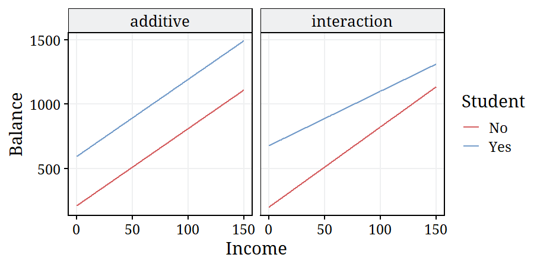<!-- -->

Fit mpg to horsepower with a linear term, quadratic term, and up to the
fifth degree:

``` r
auto <- ISLR2::Auto

lm_mpg_hp <- lm(mpg ~ horsepower, data = auto)
lm_mpg_hp2 <- lm(mpg ~ horsepower + I(horsepower^2), data = auto)
lm_mpg_hp5 <-
  lm(
    mpg ~ horsepower + I(horsepower^2) + I(horsepower^3) +
      I(horsepower^4) + I(horsepower^5),
    data = auto
  )

d <- tibble(horsepower = seq(1, 250, 0.1))

augment(lm_mpg_hp, newdata = d) %>% mutate(model = "Linear") %>%
  bind_rows(
    augment(lm_mpg_hp2, newdata = d) %>% mutate(model = "Degree 2")
  ) %>%
  bind_rows(
    augment(lm_mpg_hp5, newdata = d) %>% mutate(model = "Degree 5")
  ) %>%
  ggplot(aes(x = horsepower, y = .fitted, color = model)) +
  geom_point(
    aes(y = mpg), data = auto, color = "lightgrey", shape = 21, size = 4
  ) +
  geom_line(size = 1.5) +
  coord_cartesian(xlim = c(40, 230), ylim = c(8, 52)) +
  add_facet_borders() +
  theme(legend.position = c(0.7, 0.8)) +
  labs(y = "mpg", color = NULL)
```

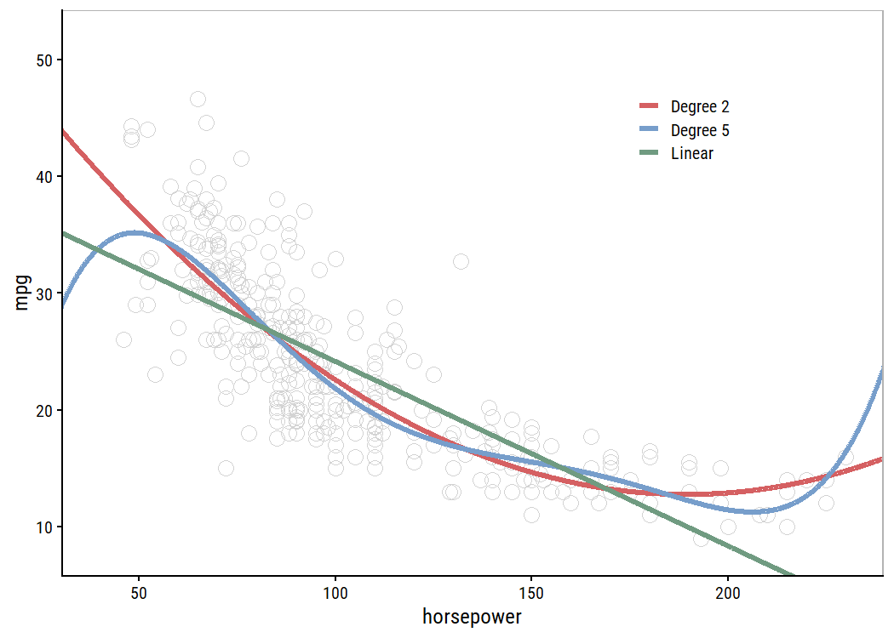<!-- -->

``` r
glance(lm_mpg_hp) %>% mutate(model = "Linear") %>%
  bind_rows(
    glance(lm_mpg_hp2) %>% mutate(model = "Degree 2")
  ) %>%
  bind_rows(
    glance(lm_mpg_hp5) %>% mutate(model = "Degree 5")
  ) %>%
  select(model, r.squared, AIC, BIC) %>%
  gt()
```

<div id="oshcfytfne" style="overflow-x:auto;overflow-y:auto;width:auto;height:auto;">
<style>html {
  font-family: -apple-system, BlinkMacSystemFont, 'Segoe UI', Roboto, Oxygen, Ubuntu, Cantarell, 'Helvetica Neue', 'Fira Sans', 'Droid Sans', Arial, sans-serif;
}

#oshcfytfne .gt_table {
  display: table;
  border-collapse: collapse;
  margin-left: auto;
  margin-right: auto;
  color: #333333;
  font-size: 16px;
  font-weight: normal;
  font-style: normal;
  background-color: #FFFFFF;
  width: auto;
  border-top-style: solid;
  border-top-width: 2px;
  border-top-color: #A8A8A8;
  border-right-style: none;
  border-right-width: 2px;
  border-right-color: #D3D3D3;
  border-bottom-style: solid;
  border-bottom-width: 2px;
  border-bottom-color: #A8A8A8;
  border-left-style: none;
  border-left-width: 2px;
  border-left-color: #D3D3D3;
}

#oshcfytfne .gt_heading {
  background-color: #FFFFFF;
  text-align: center;
  border-bottom-color: #FFFFFF;
  border-left-style: none;
  border-left-width: 1px;
  border-left-color: #D3D3D3;
  border-right-style: none;
  border-right-width: 1px;
  border-right-color: #D3D3D3;
}

#oshcfytfne .gt_title {
  color: #333333;
  font-size: 125%;
  font-weight: initial;
  padding-top: 4px;
  padding-bottom: 4px;
  border-bottom-color: #FFFFFF;
  border-bottom-width: 0;
}

#oshcfytfne .gt_subtitle {
  color: #333333;
  font-size: 85%;
  font-weight: initial;
  padding-top: 0;
  padding-bottom: 4px;
  border-top-color: #FFFFFF;
  border-top-width: 0;
}

#oshcfytfne .gt_bottom_border {
  border-bottom-style: solid;
  border-bottom-width: 2px;
  border-bottom-color: #D3D3D3;
}

#oshcfytfne .gt_col_headings {
  border-top-style: solid;
  border-top-width: 2px;
  border-top-color: #D3D3D3;
  border-bottom-style: solid;
  border-bottom-width: 2px;
  border-bottom-color: #D3D3D3;
  border-left-style: none;
  border-left-width: 1px;
  border-left-color: #D3D3D3;
  border-right-style: none;
  border-right-width: 1px;
  border-right-color: #D3D3D3;
}

#oshcfytfne .gt_col_heading {
  color: #333333;
  background-color: #FFFFFF;
  font-size: 100%;
  font-weight: normal;
  text-transform: inherit;
  border-left-style: none;
  border-left-width: 1px;
  border-left-color: #D3D3D3;
  border-right-style: none;
  border-right-width: 1px;
  border-right-color: #D3D3D3;
  vertical-align: bottom;
  padding-top: 5px;
  padding-bottom: 6px;
  padding-left: 5px;
  padding-right: 5px;
  overflow-x: hidden;
}

#oshcfytfne .gt_column_spanner_outer {
  color: #333333;
  background-color: #FFFFFF;
  font-size: 100%;
  font-weight: normal;
  text-transform: inherit;
  padding-top: 0;
  padding-bottom: 0;
  padding-left: 4px;
  padding-right: 4px;
}

#oshcfytfne .gt_column_spanner_outer:first-child {
  padding-left: 0;
}

#oshcfytfne .gt_column_spanner_outer:last-child {
  padding-right: 0;
}

#oshcfytfne .gt_column_spanner {
  border-bottom-style: solid;
  border-bottom-width: 2px;
  border-bottom-color: #D3D3D3;
  vertical-align: bottom;
  padding-top: 5px;
  padding-bottom: 6px;
  overflow-x: hidden;
  display: inline-block;
  width: 100%;
}

#oshcfytfne .gt_group_heading {
  padding: 8px;
  color: #333333;
  background-color: #FFFFFF;
  font-size: 100%;
  font-weight: initial;
  text-transform: inherit;
  border-top-style: solid;
  border-top-width: 2px;
  border-top-color: #D3D3D3;
  border-bottom-style: solid;
  border-bottom-width: 2px;
  border-bottom-color: #D3D3D3;
  border-left-style: none;
  border-left-width: 1px;
  border-left-color: #D3D3D3;
  border-right-style: none;
  border-right-width: 1px;
  border-right-color: #D3D3D3;
  vertical-align: middle;
}

#oshcfytfne .gt_empty_group_heading {
  padding: 0.5px;
  color: #333333;
  background-color: #FFFFFF;
  font-size: 100%;
  font-weight: initial;
  border-top-style: solid;
  border-top-width: 2px;
  border-top-color: #D3D3D3;
  border-bottom-style: solid;
  border-bottom-width: 2px;
  border-bottom-color: #D3D3D3;
  vertical-align: middle;
}

#oshcfytfne .gt_from_md > :first-child {
  margin-top: 0;
}

#oshcfytfne .gt_from_md > :last-child {
  margin-bottom: 0;
}

#oshcfytfne .gt_row {
  padding-top: 8px;
  padding-bottom: 8px;
  padding-left: 5px;
  padding-right: 5px;
  margin: 10px;
  border-top-style: solid;
  border-top-width: 1px;
  border-top-color: #D3D3D3;
  border-left-style: none;
  border-left-width: 1px;
  border-left-color: #D3D3D3;
  border-right-style: none;
  border-right-width: 1px;
  border-right-color: #D3D3D3;
  vertical-align: middle;
  overflow-x: hidden;
}

#oshcfytfne .gt_stub {
  color: #333333;
  background-color: #FFFFFF;
  font-size: 100%;
  font-weight: initial;
  text-transform: inherit;
  border-right-style: solid;
  border-right-width: 2px;
  border-right-color: #D3D3D3;
  padding-left: 12px;
}

#oshcfytfne .gt_summary_row {
  color: #333333;
  background-color: #FFFFFF;
  text-transform: inherit;
  padding-top: 8px;
  padding-bottom: 8px;
  padding-left: 5px;
  padding-right: 5px;
}

#oshcfytfne .gt_first_summary_row {
  padding-top: 8px;
  padding-bottom: 8px;
  padding-left: 5px;
  padding-right: 5px;
  border-top-style: solid;
  border-top-width: 2px;
  border-top-color: #D3D3D3;
}

#oshcfytfne .gt_grand_summary_row {
  color: #333333;
  background-color: #FFFFFF;
  text-transform: inherit;
  padding-top: 8px;
  padding-bottom: 8px;
  padding-left: 5px;
  padding-right: 5px;
}

#oshcfytfne .gt_first_grand_summary_row {
  padding-top: 8px;
  padding-bottom: 8px;
  padding-left: 5px;
  padding-right: 5px;
  border-top-style: double;
  border-top-width: 6px;
  border-top-color: #D3D3D3;
}

#oshcfytfne .gt_striped {
  background-color: rgba(128, 128, 128, 0.05);
}

#oshcfytfne .gt_table_body {
  border-top-style: solid;
  border-top-width: 2px;
  border-top-color: #D3D3D3;
  border-bottom-style: solid;
  border-bottom-width: 2px;
  border-bottom-color: #D3D3D3;
}

#oshcfytfne .gt_footnotes {
  color: #333333;
  background-color: #FFFFFF;
  border-bottom-style: none;
  border-bottom-width: 2px;
  border-bottom-color: #D3D3D3;
  border-left-style: none;
  border-left-width: 2px;
  border-left-color: #D3D3D3;
  border-right-style: none;
  border-right-width: 2px;
  border-right-color: #D3D3D3;
}

#oshcfytfne .gt_footnote {
  margin: 0px;
  font-size: 90%;
  padding: 4px;
}

#oshcfytfne .gt_sourcenotes {
  color: #333333;
  background-color: #FFFFFF;
  border-bottom-style: none;
  border-bottom-width: 2px;
  border-bottom-color: #D3D3D3;
  border-left-style: none;
  border-left-width: 2px;
  border-left-color: #D3D3D3;
  border-right-style: none;
  border-right-width: 2px;
  border-right-color: #D3D3D3;
}

#oshcfytfne .gt_sourcenote {
  font-size: 90%;
  padding: 4px;
}

#oshcfytfne .gt_left {
  text-align: left;
}

#oshcfytfne .gt_center {
  text-align: center;
}

#oshcfytfne .gt_right {
  text-align: right;
  font-variant-numeric: tabular-nums;
}

#oshcfytfne .gt_font_normal {
  font-weight: normal;
}

#oshcfytfne .gt_font_bold {
  font-weight: bold;
}

#oshcfytfne .gt_font_italic {
  font-style: italic;
}

#oshcfytfne .gt_super {
  font-size: 65%;
}

#oshcfytfne .gt_footnote_marks {
  font-style: italic;
  font-weight: normal;
  font-size: 65%;
}
</style>
<table class="gt_table">
  
  <thead class="gt_col_headings">
    <tr>
      <th class="gt_col_heading gt_columns_bottom_border gt_left" rowspan="1" colspan="1">model</th>
      <th class="gt_col_heading gt_columns_bottom_border gt_right" rowspan="1" colspan="1">r.squared</th>
      <th class="gt_col_heading gt_columns_bottom_border gt_right" rowspan="1" colspan="1">AIC</th>
      <th class="gt_col_heading gt_columns_bottom_border gt_right" rowspan="1" colspan="1">BIC</th>
    </tr>
  </thead>
  <tbody class="gt_table_body">
    <tr><td class="gt_row gt_left">Linear</td>
<td class="gt_row gt_right">0.6059483</td>
<td class="gt_row gt_right">2363.324</td>
<td class="gt_row gt_right">2375.237</td></tr>
    <tr><td class="gt_row gt_left">Degree 2</td>
<td class="gt_row gt_right">0.6875590</td>
<td class="gt_row gt_right">2274.354</td>
<td class="gt_row gt_right">2290.239</td></tr>
    <tr><td class="gt_row gt_left">Degree 5</td>
<td class="gt_row gt_right">0.6967390</td>
<td class="gt_row gt_right">2268.663</td>
<td class="gt_row gt_right">2296.462</td></tr>
  </tbody>
  
  
</table>
</div>

## 3.3 Potential Problems

1.  Non-linearity of the Data

``` r
plot(lm_mpg_hp, 1)
```

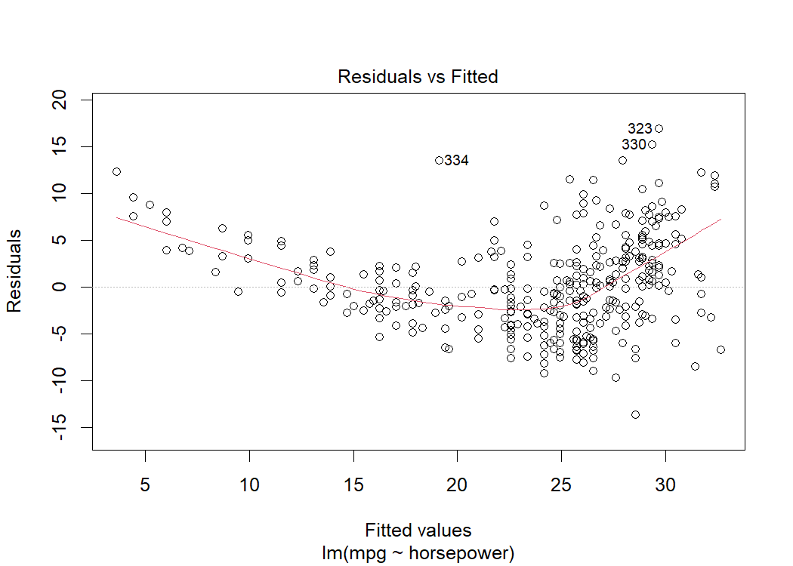<!-- -->

``` r
plot(lm_mpg_hp2, 1)
```

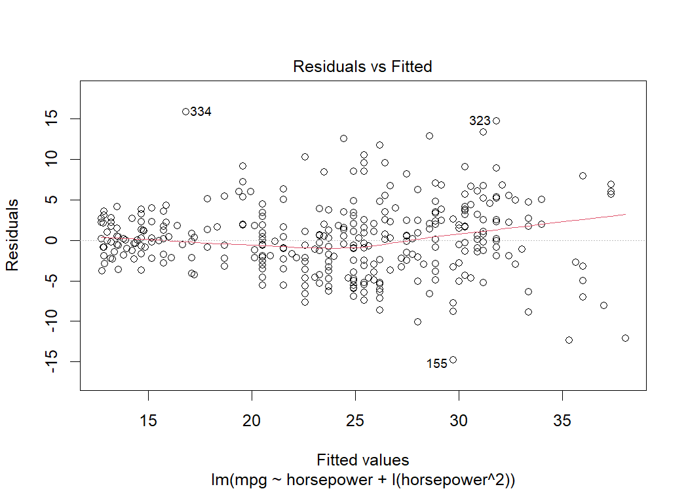<!-- -->

2.  Correlation of Error Terms

3.  Non-constant Variance of Error Terms

``` r
plot(lm_mpg_hp)
```

<!-- -->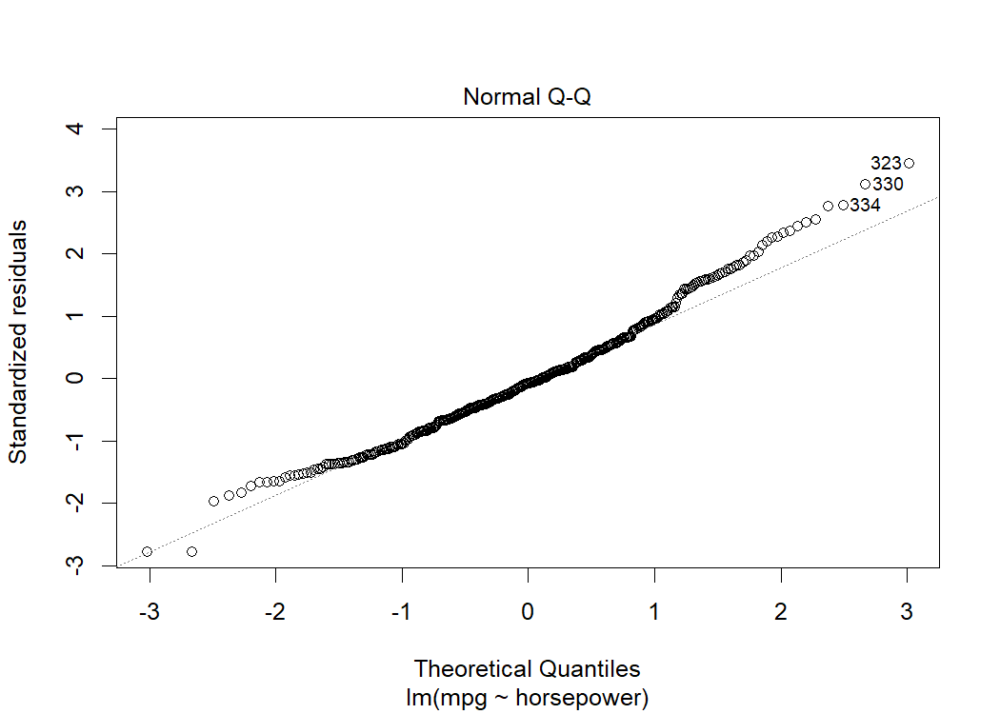<!-- -->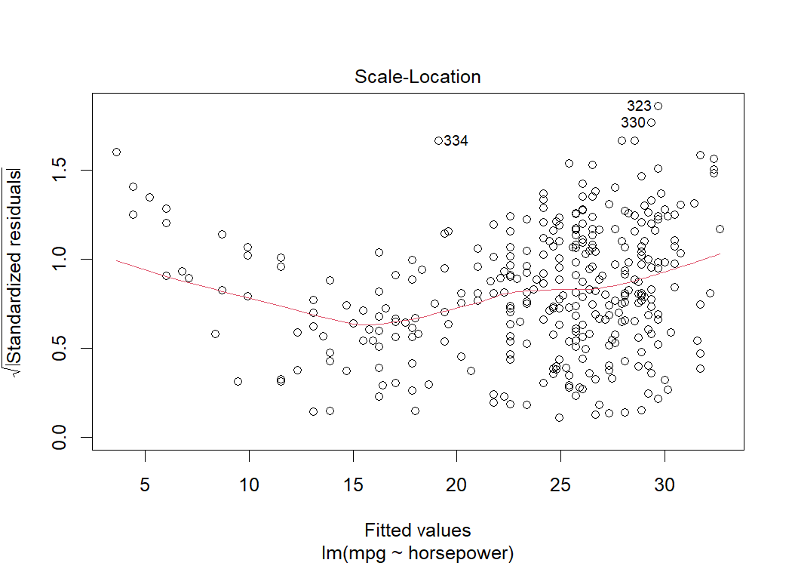<!-- -->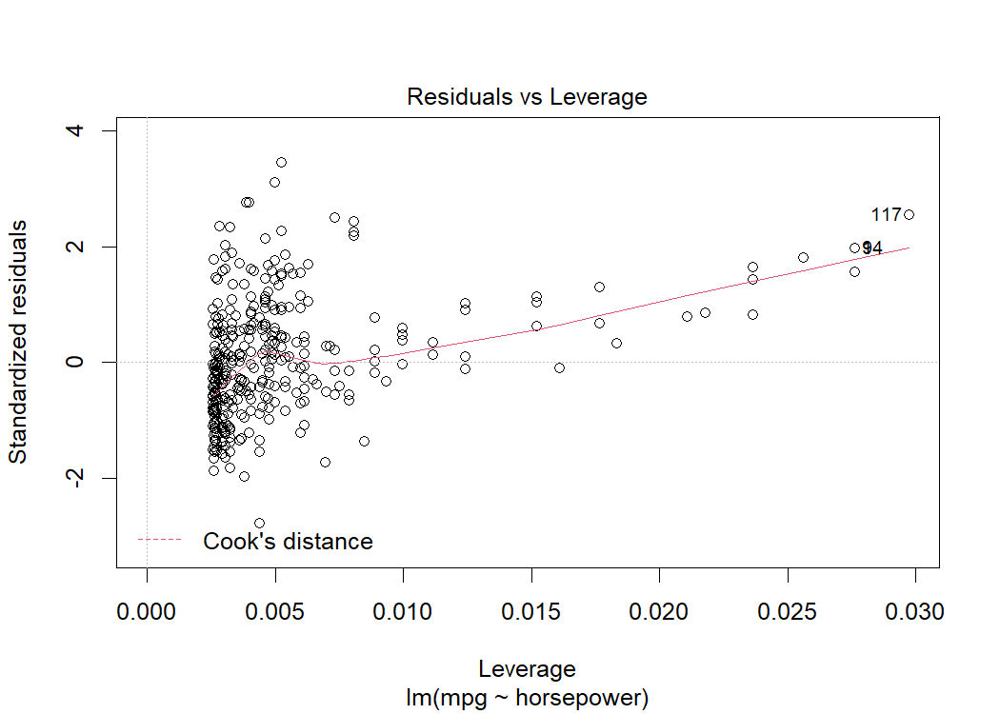<!-- -->

4.  Outliers

5.  High Leverage Points

6.  Collinearity

``` r
credit %>%
  select(Limit, Age, Rating) %>%
  pivot_longer(cols = c(Age, Rating)) %>%
  ggplot(aes(x = Limit, y = value)) +
  geom_point() +
  facet_wrap(~name, nrow = 1, scales = "free_y")
```

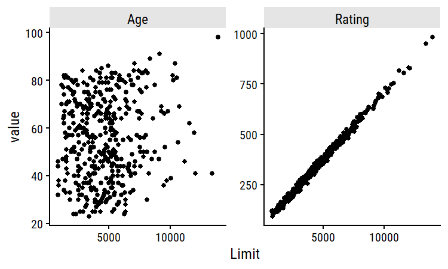<!-- -->

``` r
lm_balance_age_limit <- lm(Balance ~ Age + Limit, data = credit)
lm_balance_rating_limit <- lm(Balance ~ Rating + Limit, data = credit)

tbl_regression(lm_balance_age_limit)
```

<div id="zbrvajdeiw" style="overflow-x:auto;overflow-y:auto;width:auto;height:auto;">
<style>html {
  font-family: -apple-system, BlinkMacSystemFont, 'Segoe UI', Roboto, Oxygen, Ubuntu, Cantarell, 'Helvetica Neue', 'Fira Sans', 'Droid Sans', Arial, sans-serif;
}

#zbrvajdeiw .gt_table {
  display: table;
  border-collapse: collapse;
  margin-left: auto;
  margin-right: auto;
  color: #333333;
  font-size: 16px;
  font-weight: normal;
  font-style: normal;
  background-color: #FFFFFF;
  width: auto;
  border-top-style: solid;
  border-top-width: 2px;
  border-top-color: #A8A8A8;
  border-right-style: none;
  border-right-width: 2px;
  border-right-color: #D3D3D3;
  border-bottom-style: solid;
  border-bottom-width: 2px;
  border-bottom-color: #A8A8A8;
  border-left-style: none;
  border-left-width: 2px;
  border-left-color: #D3D3D3;
}

#zbrvajdeiw .gt_heading {
  background-color: #FFFFFF;
  text-align: center;
  border-bottom-color: #FFFFFF;
  border-left-style: none;
  border-left-width: 1px;
  border-left-color: #D3D3D3;
  border-right-style: none;
  border-right-width: 1px;
  border-right-color: #D3D3D3;
}

#zbrvajdeiw .gt_title {
  color: #333333;
  font-size: 125%;
  font-weight: initial;
  padding-top: 4px;
  padding-bottom: 4px;
  border-bottom-color: #FFFFFF;
  border-bottom-width: 0;
}

#zbrvajdeiw .gt_subtitle {
  color: #333333;
  font-size: 85%;
  font-weight: initial;
  padding-top: 0;
  padding-bottom: 4px;
  border-top-color: #FFFFFF;
  border-top-width: 0;
}

#zbrvajdeiw .gt_bottom_border {
  border-bottom-style: solid;
  border-bottom-width: 2px;
  border-bottom-color: #D3D3D3;
}

#zbrvajdeiw .gt_col_headings {
  border-top-style: solid;
  border-top-width: 2px;
  border-top-color: #D3D3D3;
  border-bottom-style: solid;
  border-bottom-width: 2px;
  border-bottom-color: #D3D3D3;
  border-left-style: none;
  border-left-width: 1px;
  border-left-color: #D3D3D3;
  border-right-style: none;
  border-right-width: 1px;
  border-right-color: #D3D3D3;
}

#zbrvajdeiw .gt_col_heading {
  color: #333333;
  background-color: #FFFFFF;
  font-size: 100%;
  font-weight: normal;
  text-transform: inherit;
  border-left-style: none;
  border-left-width: 1px;
  border-left-color: #D3D3D3;
  border-right-style: none;
  border-right-width: 1px;
  border-right-color: #D3D3D3;
  vertical-align: bottom;
  padding-top: 5px;
  padding-bottom: 6px;
  padding-left: 5px;
  padding-right: 5px;
  overflow-x: hidden;
}

#zbrvajdeiw .gt_column_spanner_outer {
  color: #333333;
  background-color: #FFFFFF;
  font-size: 100%;
  font-weight: normal;
  text-transform: inherit;
  padding-top: 0;
  padding-bottom: 0;
  padding-left: 4px;
  padding-right: 4px;
}

#zbrvajdeiw .gt_column_spanner_outer:first-child {
  padding-left: 0;
}

#zbrvajdeiw .gt_column_spanner_outer:last-child {
  padding-right: 0;
}

#zbrvajdeiw .gt_column_spanner {
  border-bottom-style: solid;
  border-bottom-width: 2px;
  border-bottom-color: #D3D3D3;
  vertical-align: bottom;
  padding-top: 5px;
  padding-bottom: 6px;
  overflow-x: hidden;
  display: inline-block;
  width: 100%;
}

#zbrvajdeiw .gt_group_heading {
  padding: 8px;
  color: #333333;
  background-color: #FFFFFF;
  font-size: 100%;
  font-weight: initial;
  text-transform: inherit;
  border-top-style: solid;
  border-top-width: 2px;
  border-top-color: #D3D3D3;
  border-bottom-style: solid;
  border-bottom-width: 2px;
  border-bottom-color: #D3D3D3;
  border-left-style: none;
  border-left-width: 1px;
  border-left-color: #D3D3D3;
  border-right-style: none;
  border-right-width: 1px;
  border-right-color: #D3D3D3;
  vertical-align: middle;
}

#zbrvajdeiw .gt_empty_group_heading {
  padding: 0.5px;
  color: #333333;
  background-color: #FFFFFF;
  font-size: 100%;
  font-weight: initial;
  border-top-style: solid;
  border-top-width: 2px;
  border-top-color: #D3D3D3;
  border-bottom-style: solid;
  border-bottom-width: 2px;
  border-bottom-color: #D3D3D3;
  vertical-align: middle;
}

#zbrvajdeiw .gt_from_md > :first-child {
  margin-top: 0;
}

#zbrvajdeiw .gt_from_md > :last-child {
  margin-bottom: 0;
}

#zbrvajdeiw .gt_row {
  padding-top: 8px;
  padding-bottom: 8px;
  padding-left: 5px;
  padding-right: 5px;
  margin: 10px;
  border-top-style: solid;
  border-top-width: 1px;
  border-top-color: #D3D3D3;
  border-left-style: none;
  border-left-width: 1px;
  border-left-color: #D3D3D3;
  border-right-style: none;
  border-right-width: 1px;
  border-right-color: #D3D3D3;
  vertical-align: middle;
  overflow-x: hidden;
}

#zbrvajdeiw .gt_stub {
  color: #333333;
  background-color: #FFFFFF;
  font-size: 100%;
  font-weight: initial;
  text-transform: inherit;
  border-right-style: solid;
  border-right-width: 2px;
  border-right-color: #D3D3D3;
  padding-left: 12px;
}

#zbrvajdeiw .gt_summary_row {
  color: #333333;
  background-color: #FFFFFF;
  text-transform: inherit;
  padding-top: 8px;
  padding-bottom: 8px;
  padding-left: 5px;
  padding-right: 5px;
}

#zbrvajdeiw .gt_first_summary_row {
  padding-top: 8px;
  padding-bottom: 8px;
  padding-left: 5px;
  padding-right: 5px;
  border-top-style: solid;
  border-top-width: 2px;
  border-top-color: #D3D3D3;
}

#zbrvajdeiw .gt_grand_summary_row {
  color: #333333;
  background-color: #FFFFFF;
  text-transform: inherit;
  padding-top: 8px;
  padding-bottom: 8px;
  padding-left: 5px;
  padding-right: 5px;
}

#zbrvajdeiw .gt_first_grand_summary_row {
  padding-top: 8px;
  padding-bottom: 8px;
  padding-left: 5px;
  padding-right: 5px;
  border-top-style: double;
  border-top-width: 6px;
  border-top-color: #D3D3D3;
}

#zbrvajdeiw .gt_striped {
  background-color: rgba(128, 128, 128, 0.05);
}

#zbrvajdeiw .gt_table_body {
  border-top-style: solid;
  border-top-width: 2px;
  border-top-color: #D3D3D3;
  border-bottom-style: solid;
  border-bottom-width: 2px;
  border-bottom-color: #D3D3D3;
}

#zbrvajdeiw .gt_footnotes {
  color: #333333;
  background-color: #FFFFFF;
  border-bottom-style: none;
  border-bottom-width: 2px;
  border-bottom-color: #D3D3D3;
  border-left-style: none;
  border-left-width: 2px;
  border-left-color: #D3D3D3;
  border-right-style: none;
  border-right-width: 2px;
  border-right-color: #D3D3D3;
}

#zbrvajdeiw .gt_footnote {
  margin: 0px;
  font-size: 90%;
  padding: 4px;
}

#zbrvajdeiw .gt_sourcenotes {
  color: #333333;
  background-color: #FFFFFF;
  border-bottom-style: none;
  border-bottom-width: 2px;
  border-bottom-color: #D3D3D3;
  border-left-style: none;
  border-left-width: 2px;
  border-left-color: #D3D3D3;
  border-right-style: none;
  border-right-width: 2px;
  border-right-color: #D3D3D3;
}

#zbrvajdeiw .gt_sourcenote {
  font-size: 90%;
  padding: 4px;
}

#zbrvajdeiw .gt_left {
  text-align: left;
}

#zbrvajdeiw .gt_center {
  text-align: center;
}

#zbrvajdeiw .gt_right {
  text-align: right;
  font-variant-numeric: tabular-nums;
}

#zbrvajdeiw .gt_font_normal {
  font-weight: normal;
}

#zbrvajdeiw .gt_font_bold {
  font-weight: bold;
}

#zbrvajdeiw .gt_font_italic {
  font-style: italic;
}

#zbrvajdeiw .gt_super {
  font-size: 65%;
}

#zbrvajdeiw .gt_footnote_marks {
  font-style: italic;
  font-weight: normal;
  font-size: 65%;
}
</style>
<table class="gt_table">
  
  <thead class="gt_col_headings">
    <tr>
      <th class="gt_col_heading gt_columns_bottom_border gt_left" rowspan="1" colspan="1"><strong>Characteristic</strong></th>
      <th class="gt_col_heading gt_columns_bottom_border gt_center" rowspan="1" colspan="1"><strong>Beta</strong></th>
      <th class="gt_col_heading gt_columns_bottom_border gt_center" rowspan="1" colspan="1"><strong>95% CI</strong><sup class="gt_footnote_marks">1</sup></th>
      <th class="gt_col_heading gt_columns_bottom_border gt_center" rowspan="1" colspan="1"><strong>p-value</strong></th>
    </tr>
  </thead>
  <tbody class="gt_table_body">
    <tr><td class="gt_row gt_left">Age</td>
<td class="gt_row gt_center">-2.3</td>
<td class="gt_row gt_center">-3.6, -1.0</td>
<td class="gt_row gt_center"><0.001</td></tr>
    <tr><td class="gt_row gt_left">Limit</td>
<td class="gt_row gt_center">0.17</td>
<td class="gt_row gt_center">0.16, 0.18</td>
<td class="gt_row gt_center"><0.001</td></tr>
  </tbody>
  
  <tfoot>
    <tr class="gt_footnotes">
      <td colspan="4">
        <p class="gt_footnote">
          <sup class="gt_footnote_marks">
            <em>1</em>
          </sup>
           
          CI = Confidence Interval
          <br />
        </p>
      </td>
    </tr>
  </tfoot>
</table>
</div>

``` r
tbl_regression(lm_balance_rating_limit)
```

<div id="uxijjlmhlk" style="overflow-x:auto;overflow-y:auto;width:auto;height:auto;">
<style>html {
  font-family: -apple-system, BlinkMacSystemFont, 'Segoe UI', Roboto, Oxygen, Ubuntu, Cantarell, 'Helvetica Neue', 'Fira Sans', 'Droid Sans', Arial, sans-serif;
}

#uxijjlmhlk .gt_table {
  display: table;
  border-collapse: collapse;
  margin-left: auto;
  margin-right: auto;
  color: #333333;
  font-size: 16px;
  font-weight: normal;
  font-style: normal;
  background-color: #FFFFFF;
  width: auto;
  border-top-style: solid;
  border-top-width: 2px;
  border-top-color: #A8A8A8;
  border-right-style: none;
  border-right-width: 2px;
  border-right-color: #D3D3D3;
  border-bottom-style: solid;
  border-bottom-width: 2px;
  border-bottom-color: #A8A8A8;
  border-left-style: none;
  border-left-width: 2px;
  border-left-color: #D3D3D3;
}

#uxijjlmhlk .gt_heading {
  background-color: #FFFFFF;
  text-align: center;
  border-bottom-color: #FFFFFF;
  border-left-style: none;
  border-left-width: 1px;
  border-left-color: #D3D3D3;
  border-right-style: none;
  border-right-width: 1px;
  border-right-color: #D3D3D3;
}

#uxijjlmhlk .gt_title {
  color: #333333;
  font-size: 125%;
  font-weight: initial;
  padding-top: 4px;
  padding-bottom: 4px;
  border-bottom-color: #FFFFFF;
  border-bottom-width: 0;
}

#uxijjlmhlk .gt_subtitle {
  color: #333333;
  font-size: 85%;
  font-weight: initial;
  padding-top: 0;
  padding-bottom: 4px;
  border-top-color: #FFFFFF;
  border-top-width: 0;
}

#uxijjlmhlk .gt_bottom_border {
  border-bottom-style: solid;
  border-bottom-width: 2px;
  border-bottom-color: #D3D3D3;
}

#uxijjlmhlk .gt_col_headings {
  border-top-style: solid;
  border-top-width: 2px;
  border-top-color: #D3D3D3;
  border-bottom-style: solid;
  border-bottom-width: 2px;
  border-bottom-color: #D3D3D3;
  border-left-style: none;
  border-left-width: 1px;
  border-left-color: #D3D3D3;
  border-right-style: none;
  border-right-width: 1px;
  border-right-color: #D3D3D3;
}

#uxijjlmhlk .gt_col_heading {
  color: #333333;
  background-color: #FFFFFF;
  font-size: 100%;
  font-weight: normal;
  text-transform: inherit;
  border-left-style: none;
  border-left-width: 1px;
  border-left-color: #D3D3D3;
  border-right-style: none;
  border-right-width: 1px;
  border-right-color: #D3D3D3;
  vertical-align: bottom;
  padding-top: 5px;
  padding-bottom: 6px;
  padding-left: 5px;
  padding-right: 5px;
  overflow-x: hidden;
}

#uxijjlmhlk .gt_column_spanner_outer {
  color: #333333;
  background-color: #FFFFFF;
  font-size: 100%;
  font-weight: normal;
  text-transform: inherit;
  padding-top: 0;
  padding-bottom: 0;
  padding-left: 4px;
  padding-right: 4px;
}

#uxijjlmhlk .gt_column_spanner_outer:first-child {
  padding-left: 0;
}

#uxijjlmhlk .gt_column_spanner_outer:last-child {
  padding-right: 0;
}

#uxijjlmhlk .gt_column_spanner {
  border-bottom-style: solid;
  border-bottom-width: 2px;
  border-bottom-color: #D3D3D3;
  vertical-align: bottom;
  padding-top: 5px;
  padding-bottom: 6px;
  overflow-x: hidden;
  display: inline-block;
  width: 100%;
}

#uxijjlmhlk .gt_group_heading {
  padding: 8px;
  color: #333333;
  background-color: #FFFFFF;
  font-size: 100%;
  font-weight: initial;
  text-transform: inherit;
  border-top-style: solid;
  border-top-width: 2px;
  border-top-color: #D3D3D3;
  border-bottom-style: solid;
  border-bottom-width: 2px;
  border-bottom-color: #D3D3D3;
  border-left-style: none;
  border-left-width: 1px;
  border-left-color: #D3D3D3;
  border-right-style: none;
  border-right-width: 1px;
  border-right-color: #D3D3D3;
  vertical-align: middle;
}

#uxijjlmhlk .gt_empty_group_heading {
  padding: 0.5px;
  color: #333333;
  background-color: #FFFFFF;
  font-size: 100%;
  font-weight: initial;
  border-top-style: solid;
  border-top-width: 2px;
  border-top-color: #D3D3D3;
  border-bottom-style: solid;
  border-bottom-width: 2px;
  border-bottom-color: #D3D3D3;
  vertical-align: middle;
}

#uxijjlmhlk .gt_from_md > :first-child {
  margin-top: 0;
}

#uxijjlmhlk .gt_from_md > :last-child {
  margin-bottom: 0;
}

#uxijjlmhlk .gt_row {
  padding-top: 8px;
  padding-bottom: 8px;
  padding-left: 5px;
  padding-right: 5px;
  margin: 10px;
  border-top-style: solid;
  border-top-width: 1px;
  border-top-color: #D3D3D3;
  border-left-style: none;
  border-left-width: 1px;
  border-left-color: #D3D3D3;
  border-right-style: none;
  border-right-width: 1px;
  border-right-color: #D3D3D3;
  vertical-align: middle;
  overflow-x: hidden;
}

#uxijjlmhlk .gt_stub {
  color: #333333;
  background-color: #FFFFFF;
  font-size: 100%;
  font-weight: initial;
  text-transform: inherit;
  border-right-style: solid;
  border-right-width: 2px;
  border-right-color: #D3D3D3;
  padding-left: 12px;
}

#uxijjlmhlk .gt_summary_row {
  color: #333333;
  background-color: #FFFFFF;
  text-transform: inherit;
  padding-top: 8px;
  padding-bottom: 8px;
  padding-left: 5px;
  padding-right: 5px;
}

#uxijjlmhlk .gt_first_summary_row {
  padding-top: 8px;
  padding-bottom: 8px;
  padding-left: 5px;
  padding-right: 5px;
  border-top-style: solid;
  border-top-width: 2px;
  border-top-color: #D3D3D3;
}

#uxijjlmhlk .gt_grand_summary_row {
  color: #333333;
  background-color: #FFFFFF;
  text-transform: inherit;
  padding-top: 8px;
  padding-bottom: 8px;
  padding-left: 5px;
  padding-right: 5px;
}

#uxijjlmhlk .gt_first_grand_summary_row {
  padding-top: 8px;
  padding-bottom: 8px;
  padding-left: 5px;
  padding-right: 5px;
  border-top-style: double;
  border-top-width: 6px;
  border-top-color: #D3D3D3;
}

#uxijjlmhlk .gt_striped {
  background-color: rgba(128, 128, 128, 0.05);
}

#uxijjlmhlk .gt_table_body {
  border-top-style: solid;
  border-top-width: 2px;
  border-top-color: #D3D3D3;
  border-bottom-style: solid;
  border-bottom-width: 2px;
  border-bottom-color: #D3D3D3;
}

#uxijjlmhlk .gt_footnotes {
  color: #333333;
  background-color: #FFFFFF;
  border-bottom-style: none;
  border-bottom-width: 2px;
  border-bottom-color: #D3D3D3;
  border-left-style: none;
  border-left-width: 2px;
  border-left-color: #D3D3D3;
  border-right-style: none;
  border-right-width: 2px;
  border-right-color: #D3D3D3;
}

#uxijjlmhlk .gt_footnote {
  margin: 0px;
  font-size: 90%;
  padding: 4px;
}

#uxijjlmhlk .gt_sourcenotes {
  color: #333333;
  background-color: #FFFFFF;
  border-bottom-style: none;
  border-bottom-width: 2px;
  border-bottom-color: #D3D3D3;
  border-left-style: none;
  border-left-width: 2px;
  border-left-color: #D3D3D3;
  border-right-style: none;
  border-right-width: 2px;
  border-right-color: #D3D3D3;
}

#uxijjlmhlk .gt_sourcenote {
  font-size: 90%;
  padding: 4px;
}

#uxijjlmhlk .gt_left {
  text-align: left;
}

#uxijjlmhlk .gt_center {
  text-align: center;
}

#uxijjlmhlk .gt_right {
  text-align: right;
  font-variant-numeric: tabular-nums;
}

#uxijjlmhlk .gt_font_normal {
  font-weight: normal;
}

#uxijjlmhlk .gt_font_bold {
  font-weight: bold;
}

#uxijjlmhlk .gt_font_italic {
  font-style: italic;
}

#uxijjlmhlk .gt_super {
  font-size: 65%;
}

#uxijjlmhlk .gt_footnote_marks {
  font-style: italic;
  font-weight: normal;
  font-size: 65%;
}
</style>
<table class="gt_table">
  
  <thead class="gt_col_headings">
    <tr>
      <th class="gt_col_heading gt_columns_bottom_border gt_left" rowspan="1" colspan="1"><strong>Characteristic</strong></th>
      <th class="gt_col_heading gt_columns_bottom_border gt_center" rowspan="1" colspan="1"><strong>Beta</strong></th>
      <th class="gt_col_heading gt_columns_bottom_border gt_center" rowspan="1" colspan="1"><strong>95% CI</strong><sup class="gt_footnote_marks">1</sup></th>
      <th class="gt_col_heading gt_columns_bottom_border gt_center" rowspan="1" colspan="1"><strong>p-value</strong></th>
    </tr>
  </thead>
  <tbody class="gt_table_body">
    <tr><td class="gt_row gt_left">Rating</td>
<td class="gt_row gt_center">2.2</td>
<td class="gt_row gt_center">0.33, 4.1</td>
<td class="gt_row gt_center">0.021</td></tr>
    <tr><td class="gt_row gt_left">Limit</td>
<td class="gt_row gt_center">0.02</td>
<td class="gt_row gt_center">-0.10, 0.15</td>
<td class="gt_row gt_center">0.7</td></tr>
  </tbody>
  
  <tfoot>
    <tr class="gt_footnotes">
      <td colspan="4">
        <p class="gt_footnote">
          <sup class="gt_footnote_marks">
            <em>1</em>
          </sup>
           
          CI = Confidence Interval
          <br />
        </p>
      </td>
    </tr>
  </tfoot>
</table>
</div>

To calculate variance inflation factors (VIF), there are R functions
such as `car::vif` which can be used, but it is fairly simple to
calculate by hand:

``` r
lm_rating_age_limit <- lm(Rating ~ Age + Limit, data = credit)
lm_age_rating_limit <- lm(Age ~ Rating + Limit, data = credit)
lm_limit_age_rating <- lm(Limit ~ Age + Rating, data = credit)
tribble(
  ~Predictor, ~`R^2`,
  "Age", 1 / (1 - summary(lm_age_rating_limit)$r.squared),
  "Rating", 1 / (1 - summary(lm_rating_age_limit)$r.squared),
  "Limit", 1 / (1 - summary(lm_limit_age_rating)$r.squared)
) %>%
  gt()
```

<div id="smwahzqokx" style="overflow-x:auto;overflow-y:auto;width:auto;height:auto;">
<style>html {
  font-family: -apple-system, BlinkMacSystemFont, 'Segoe UI', Roboto, Oxygen, Ubuntu, Cantarell, 'Helvetica Neue', 'Fira Sans', 'Droid Sans', Arial, sans-serif;
}

#smwahzqokx .gt_table {
  display: table;
  border-collapse: collapse;
  margin-left: auto;
  margin-right: auto;
  color: #333333;
  font-size: 16px;
  font-weight: normal;
  font-style: normal;
  background-color: #FFFFFF;
  width: auto;
  border-top-style: solid;
  border-top-width: 2px;
  border-top-color: #A8A8A8;
  border-right-style: none;
  border-right-width: 2px;
  border-right-color: #D3D3D3;
  border-bottom-style: solid;
  border-bottom-width: 2px;
  border-bottom-color: #A8A8A8;
  border-left-style: none;
  border-left-width: 2px;
  border-left-color: #D3D3D3;
}

#smwahzqokx .gt_heading {
  background-color: #FFFFFF;
  text-align: center;
  border-bottom-color: #FFFFFF;
  border-left-style: none;
  border-left-width: 1px;
  border-left-color: #D3D3D3;
  border-right-style: none;
  border-right-width: 1px;
  border-right-color: #D3D3D3;
}

#smwahzqokx .gt_title {
  color: #333333;
  font-size: 125%;
  font-weight: initial;
  padding-top: 4px;
  padding-bottom: 4px;
  border-bottom-color: #FFFFFF;
  border-bottom-width: 0;
}

#smwahzqokx .gt_subtitle {
  color: #333333;
  font-size: 85%;
  font-weight: initial;
  padding-top: 0;
  padding-bottom: 4px;
  border-top-color: #FFFFFF;
  border-top-width: 0;
}

#smwahzqokx .gt_bottom_border {
  border-bottom-style: solid;
  border-bottom-width: 2px;
  border-bottom-color: #D3D3D3;
}

#smwahzqokx .gt_col_headings {
  border-top-style: solid;
  border-top-width: 2px;
  border-top-color: #D3D3D3;
  border-bottom-style: solid;
  border-bottom-width: 2px;
  border-bottom-color: #D3D3D3;
  border-left-style: none;
  border-left-width: 1px;
  border-left-color: #D3D3D3;
  border-right-style: none;
  border-right-width: 1px;
  border-right-color: #D3D3D3;
}

#smwahzqokx .gt_col_heading {
  color: #333333;
  background-color: #FFFFFF;
  font-size: 100%;
  font-weight: normal;
  text-transform: inherit;
  border-left-style: none;
  border-left-width: 1px;
  border-left-color: #D3D3D3;
  border-right-style: none;
  border-right-width: 1px;
  border-right-color: #D3D3D3;
  vertical-align: bottom;
  padding-top: 5px;
  padding-bottom: 6px;
  padding-left: 5px;
  padding-right: 5px;
  overflow-x: hidden;
}

#smwahzqokx .gt_column_spanner_outer {
  color: #333333;
  background-color: #FFFFFF;
  font-size: 100%;
  font-weight: normal;
  text-transform: inherit;
  padding-top: 0;
  padding-bottom: 0;
  padding-left: 4px;
  padding-right: 4px;
}

#smwahzqokx .gt_column_spanner_outer:first-child {
  padding-left: 0;
}

#smwahzqokx .gt_column_spanner_outer:last-child {
  padding-right: 0;
}

#smwahzqokx .gt_column_spanner {
  border-bottom-style: solid;
  border-bottom-width: 2px;
  border-bottom-color: #D3D3D3;
  vertical-align: bottom;
  padding-top: 5px;
  padding-bottom: 6px;
  overflow-x: hidden;
  display: inline-block;
  width: 100%;
}

#smwahzqokx .gt_group_heading {
  padding: 8px;
  color: #333333;
  background-color: #FFFFFF;
  font-size: 100%;
  font-weight: initial;
  text-transform: inherit;
  border-top-style: solid;
  border-top-width: 2px;
  border-top-color: #D3D3D3;
  border-bottom-style: solid;
  border-bottom-width: 2px;
  border-bottom-color: #D3D3D3;
  border-left-style: none;
  border-left-width: 1px;
  border-left-color: #D3D3D3;
  border-right-style: none;
  border-right-width: 1px;
  border-right-color: #D3D3D3;
  vertical-align: middle;
}

#smwahzqokx .gt_empty_group_heading {
  padding: 0.5px;
  color: #333333;
  background-color: #FFFFFF;
  font-size: 100%;
  font-weight: initial;
  border-top-style: solid;
  border-top-width: 2px;
  border-top-color: #D3D3D3;
  border-bottom-style: solid;
  border-bottom-width: 2px;
  border-bottom-color: #D3D3D3;
  vertical-align: middle;
}

#smwahzqokx .gt_from_md > :first-child {
  margin-top: 0;
}

#smwahzqokx .gt_from_md > :last-child {
  margin-bottom: 0;
}

#smwahzqokx .gt_row {
  padding-top: 8px;
  padding-bottom: 8px;
  padding-left: 5px;
  padding-right: 5px;
  margin: 10px;
  border-top-style: solid;
  border-top-width: 1px;
  border-top-color: #D3D3D3;
  border-left-style: none;
  border-left-width: 1px;
  border-left-color: #D3D3D3;
  border-right-style: none;
  border-right-width: 1px;
  border-right-color: #D3D3D3;
  vertical-align: middle;
  overflow-x: hidden;
}

#smwahzqokx .gt_stub {
  color: #333333;
  background-color: #FFFFFF;
  font-size: 100%;
  font-weight: initial;
  text-transform: inherit;
  border-right-style: solid;
  border-right-width: 2px;
  border-right-color: #D3D3D3;
  padding-left: 12px;
}

#smwahzqokx .gt_summary_row {
  color: #333333;
  background-color: #FFFFFF;
  text-transform: inherit;
  padding-top: 8px;
  padding-bottom: 8px;
  padding-left: 5px;
  padding-right: 5px;
}

#smwahzqokx .gt_first_summary_row {
  padding-top: 8px;
  padding-bottom: 8px;
  padding-left: 5px;
  padding-right: 5px;
  border-top-style: solid;
  border-top-width: 2px;
  border-top-color: #D3D3D3;
}

#smwahzqokx .gt_grand_summary_row {
  color: #333333;
  background-color: #FFFFFF;
  text-transform: inherit;
  padding-top: 8px;
  padding-bottom: 8px;
  padding-left: 5px;
  padding-right: 5px;
}

#smwahzqokx .gt_first_grand_summary_row {
  padding-top: 8px;
  padding-bottom: 8px;
  padding-left: 5px;
  padding-right: 5px;
  border-top-style: double;
  border-top-width: 6px;
  border-top-color: #D3D3D3;
}

#smwahzqokx .gt_striped {
  background-color: rgba(128, 128, 128, 0.05);
}

#smwahzqokx .gt_table_body {
  border-top-style: solid;
  border-top-width: 2px;
  border-top-color: #D3D3D3;
  border-bottom-style: solid;
  border-bottom-width: 2px;
  border-bottom-color: #D3D3D3;
}

#smwahzqokx .gt_footnotes {
  color: #333333;
  background-color: #FFFFFF;
  border-bottom-style: none;
  border-bottom-width: 2px;
  border-bottom-color: #D3D3D3;
  border-left-style: none;
  border-left-width: 2px;
  border-left-color: #D3D3D3;
  border-right-style: none;
  border-right-width: 2px;
  border-right-color: #D3D3D3;
}

#smwahzqokx .gt_footnote {
  margin: 0px;
  font-size: 90%;
  padding: 4px;
}

#smwahzqokx .gt_sourcenotes {
  color: #333333;
  background-color: #FFFFFF;
  border-bottom-style: none;
  border-bottom-width: 2px;
  border-bottom-color: #D3D3D3;
  border-left-style: none;
  border-left-width: 2px;
  border-left-color: #D3D3D3;
  border-right-style: none;
  border-right-width: 2px;
  border-right-color: #D3D3D3;
}

#smwahzqokx .gt_sourcenote {
  font-size: 90%;
  padding: 4px;
}

#smwahzqokx .gt_left {
  text-align: left;
}

#smwahzqokx .gt_center {
  text-align: center;
}

#smwahzqokx .gt_right {
  text-align: right;
  font-variant-numeric: tabular-nums;
}

#smwahzqokx .gt_font_normal {
  font-weight: normal;
}

#smwahzqokx .gt_font_bold {
  font-weight: bold;
}

#smwahzqokx .gt_font_italic {
  font-style: italic;
}

#smwahzqokx .gt_super {
  font-size: 65%;
}

#smwahzqokx .gt_footnote_marks {
  font-style: italic;
  font-weight: normal;
  font-size: 65%;
}
</style>
<table class="gt_table">
  
  <thead class="gt_col_headings">
    <tr>
      <th class="gt_col_heading gt_columns_bottom_border gt_left" rowspan="1" colspan="1">Predictor</th>
      <th class="gt_col_heading gt_columns_bottom_border gt_right" rowspan="1" colspan="1">R^2</th>
    </tr>
  </thead>
  <tbody class="gt_table_body">
    <tr><td class="gt_row gt_left">Age</td>
<td class="gt_row gt_right">1.011385</td></tr>
    <tr><td class="gt_row gt_left">Rating</td>
<td class="gt_row gt_right">160.668301</td></tr>
    <tr><td class="gt_row gt_left">Limit</td>
<td class="gt_row gt_right">160.592880</td></tr>
  </tbody>
  
  
</table>
</div>

``` r
hatvalues(lm_rating_age_limit)
```

    ##           1           2           3           4           5           6 
    ## 0.006787381 0.009487972 0.006641148 0.017801032 0.003781047 0.010677324 
    ##           7           8           9          10          11          12 
    ## 0.006005609 0.012586117 0.004578279 0.006785655 0.014653852 0.009030671 
    ##          13          14          15          16          17          18 
    ## 0.002661034 0.005337217 0.007030517 0.004875344 0.005779585 0.004134554 
    ##          19          20          21          22          23          24 
    ## 0.010890485 0.005639780 0.004805863 0.005707681 0.004991030 0.003137336 
    ##          25          26          27          28          29          30 
    ## 0.006782499 0.010421646 0.004078316 0.003647530 0.041757438 0.002875487 
    ##          31          32          33          34          35          36 
    ## 0.003654154 0.005445915 0.007879754 0.011163978 0.011755969 0.004945604 
    ##          37          38          39          40          41          42 
    ## 0.005570054 0.005161821 0.010506518 0.003769615 0.003436494 0.007082510 
    ##          43          44          45          46          47          48 
    ## 0.003405198 0.012751800 0.012425533 0.006794778 0.003102858 0.002896327 
    ##          49          50          51          52          53          54 
    ## 0.008221877 0.002877230 0.003011699 0.009490586 0.007717280 0.003565175 
    ##          55          56          57          58          59          60 
    ## 0.007757846 0.006958461 0.007130697 0.003236834 0.005228183 0.007927496 
    ##          61          62          63          64          65          66 
    ## 0.006359018 0.003953459 0.011674777 0.007546318 0.009208506 0.008967016 
    ##          67          68          69          70          71          72 
    ## 0.018014085 0.004013195 0.006861745 0.004584493 0.006164591 0.010472979 
    ##          73          74          75          76          77          78 
    ## 0.003176810 0.007632068 0.003761435 0.009611696 0.005011537 0.008661473 
    ##          79          80          81          82          83          84 
    ## 0.005495694 0.006855410 0.005116866 0.009129018 0.003029504 0.009591087 
    ##          85          86          87          88          89          90 
    ## 0.005916481 0.031247866 0.008562292 0.005586691 0.002609740 0.006424677 
    ##          91          92          93          94          95          96 
    ## 0.004776020 0.004092972 0.004293540 0.010488409 0.004551583 0.009970754 
    ##          97          98          99         100         101         102 
    ## 0.002765437 0.006539935 0.005568008 0.010270482 0.004617425 0.007191255 
    ##         103         104         105         106         107         108 
    ## 0.006339283 0.013741377 0.002562157 0.003739897 0.011648722 0.006230815 
    ##         109         110         111         112         113         114 
    ## 0.003752065 0.006145528 0.003559591 0.004258534 0.006141219 0.009944273 
    ##         115         116         117         118         119         120 
    ## 0.005009700 0.007934842 0.006312844 0.012732722 0.007221461 0.014297931 
    ##         121         122         123         124         125         126 
    ## 0.009359005 0.013220451 0.011046089 0.012922436 0.009693487 0.008191927 
    ##         127         128         129         130         131         132 
    ## 0.003133505 0.005881362 0.016695719 0.003278475 0.002902388 0.007670887 
    ##         133         134         135         136         137         138 
    ## 0.003176637 0.007764984 0.006645932 0.009088030 0.004544418 0.006435991 
    ##         139         140         141         142         143         144 
    ## 0.009355469 0.023745658 0.008479063 0.009395510 0.011770801 0.003085894 
    ##         145         146         147         148         149         150 
    ## 0.008540464 0.002683496 0.002573617 0.007487128 0.006957052 0.010125017 
    ##         151         152         153         154         155         156 
    ## 0.009834283 0.003400151 0.013222073 0.007236299 0.008364901 0.010965988 
    ##         157         158         159         160         161         162 
    ## 0.005889322 0.004898464 0.008886703 0.003932747 0.003581973 0.013310905 
    ##         163         164         165         166         167         168 
    ## 0.006200103 0.011039527 0.004576649 0.003290102 0.007279086 0.007645498 
    ##         169         170         171         172         173         174 
    ## 0.008428769 0.007145953 0.006063679 0.003104350 0.002662581 0.002546057 
    ##         175         176         177         178         179         180 
    ## 0.019404618 0.005626756 0.008773471 0.006562990 0.008490063 0.006820196 
    ##         181         182         183         184         185         186 
    ## 0.004839886 0.007910222 0.004533537 0.008528714 0.024606495 0.008050472 
    ##         187         188         189         190         191         192 
    ## 0.002981402 0.009420922 0.011912906 0.009993746 0.002998726 0.013902899 
    ##         193         194         195         196         197         198 
    ## 0.002810506 0.019623798 0.011167059 0.005111972 0.006574442 0.009880084 
    ##         199         200         201         202         203         204 
    ## 0.006078094 0.003929757 0.004886269 0.006421411 0.007781363 0.006994759 
    ##         205         206         207         208         209         210 
    ## 0.003703765 0.008607623 0.009881677 0.005439229 0.003323957 0.020405376 
    ##         211         212         213         214         215         216 
    ## 0.004077459 0.010885002 0.003529763 0.003857983 0.002941813 0.007406237 
    ##         217         218         219         220         221         222 
    ## 0.004620597 0.003368815 0.009641744 0.006003434 0.003099392 0.013287848 
    ##         223         224         225         226         227         228 
    ## 0.004907613 0.004802739 0.007512948 0.009764314 0.008360793 0.003603669 
    ##         229         230         231         232         233         234 
    ## 0.006478400 0.009060103 0.002653911 0.008566146 0.004876485 0.007854385 
    ##         235         236         237         238         239         240 
    ## 0.010840807 0.011351269 0.005555115 0.005331085 0.004184862 0.006482385 
    ##         241         242         243         244         245         246 
    ## 0.005683971 0.011795050 0.008580211 0.004175146 0.007931362 0.011945960 
    ##         247         248         249         250         251         252 
    ## 0.003764374 0.005597894 0.011261343 0.008167684 0.005409192 0.004729561 
    ##         253         254         255         256         257         258 
    ## 0.009785553 0.002729615 0.007932974 0.002861758 0.009251586 0.005174562 
    ##         259         260         261         262         263         264 
    ## 0.007490162 0.003529902 0.003010882 0.012872355 0.003723548 0.003241910 
    ##         265         266         267         268         269         270 
    ## 0.002572528 0.003366281 0.010267242 0.009499402 0.014995445 0.003408805 
    ##         271         272         273         274         275         276 
    ## 0.005805772 0.008157233 0.010611228 0.002997780 0.008202906 0.010654307 
    ##         277         278         279         280         281         282 
    ## 0.003435757 0.002825780 0.008498545 0.003995585 0.006451246 0.009985352 
    ##         283         284         285         286         287         288 
    ## 0.008397462 0.006578714 0.007419183 0.008340935 0.007503875 0.005567258 
    ##         289         290         291         292         293         294 
    ## 0.004321757 0.008159596 0.008244197 0.003050235 0.007853685 0.023957248 
    ##         295         296         297         298         299         300 
    ## 0.006010864 0.009402167 0.002990613 0.005503035 0.006651366 0.005982887 
    ##         301         302         303         304         305         306 
    ## 0.002770895 0.005577282 0.003348424 0.007088528 0.006442219 0.006325770 
    ##         307         308         309         310         311         312 
    ## 0.008292670 0.004521331 0.006848827 0.009585801 0.002633247 0.002731756 
    ##         313         314         315         316         317         318 
    ## 0.003026042 0.009082916 0.013016696 0.004057087 0.005611127 0.004505358 
    ##         319         320         321         322         323         324 
    ## 0.014520502 0.004673700 0.013844696 0.010167772 0.003354906 0.052792091 
    ##         325         326         327         328         329         330 
    ## 0.005323281 0.003417655 0.020891068 0.005253030 0.003037541 0.007917912 
    ##         331         332         333         334         335         336 
    ## 0.004827895 0.003199758 0.008799654 0.004850475 0.003088833 0.011861296 
    ##         337         338         339         340         341         342 
    ## 0.004239251 0.013244909 0.003699008 0.020406595 0.006298321 0.006909742 
    ##         343         344         345         346         347         348 
    ## 0.006545625 0.003975659 0.005065137 0.010876069 0.002921326 0.020163869 
    ##         349         350         351         352         353         354 
    ## 0.011075124 0.004499560 0.009621483 0.004498610 0.007530710 0.003137280 
    ##         355         356         357         358         359         360 
    ## 0.003882879 0.027175428 0.007005153 0.006440331 0.008166600 0.007245088 
    ##         361         362         363         364         365         366 
    ## 0.008644500 0.003341469 0.002874997 0.008023851 0.015158035 0.005104514 
    ##         367         368         369         370         371         372 
    ## 0.007159637 0.005050900 0.006208230 0.007610495 0.005800850 0.009498988 
    ##         373         374         375         376         377         378 
    ## 0.003609176 0.005795210 0.005995840 0.004216350 0.006406462 0.007267150 
    ##         379         380         381         382         383         384 
    ## 0.006952083 0.011684554 0.012143526 0.013288286 0.007367242 0.004262358 
    ##         385         386         387         388         389         390 
    ## 0.010668138 0.002907955 0.003059670 0.008540736 0.008963938 0.006669220 
    ##         391         392         393         394         395         396 
    ## 0.022283776 0.005734394 0.012847869 0.009144211 0.005291145 0.007265544 
    ##         397         398         399         400 
    ## 0.003731528 0.003826430 0.005649879 0.003301925

# 3.4 The Marketing Plan

# 3.5 Comparison of Linear Regression with *K*-Nearest Neighbors

# 3.6 Lab: Linear Regression

## 3.6.1 Libraries

``` r
boston <- ISLR2::Boston
```

## 3.6.2 Simple Linear Regression

Regression median value of owner-occupied homes `medv` on lower status
of the population `lstat`:

``` r
lm_medv_lstat <- lm(medv ~ lstat, data = boston)
confint(lm_medv_lstat)
```

    ##                 2.5 %     97.5 %
    ## (Intercept) 33.448457 35.6592247
    ## lstat       -1.026148 -0.8739505

``` r
nd <- tibble(lstat = c(5, 10, 15))

predict(lm_medv_lstat, nd, interval = "confidence")
```

    ##        fit      lwr      upr
    ## 1 29.80359 29.00741 30.59978
    ## 2 25.05335 24.47413 25.63256
    ## 3 20.30310 19.73159 20.87461

``` r
predict(lm_medv_lstat, nd, interval = "prediction")
```

    ##        fit       lwr      upr
    ## 1 29.80359 17.565675 42.04151
    ## 2 25.05335 12.827626 37.27907
    ## 3 20.30310  8.077742 32.52846

``` r
boston %>%
  ggplot(aes(x = lstat, y = medv)) +
  geom_point() +
  geom_smooth(method = "lm" , formula = "y ~ x")
```

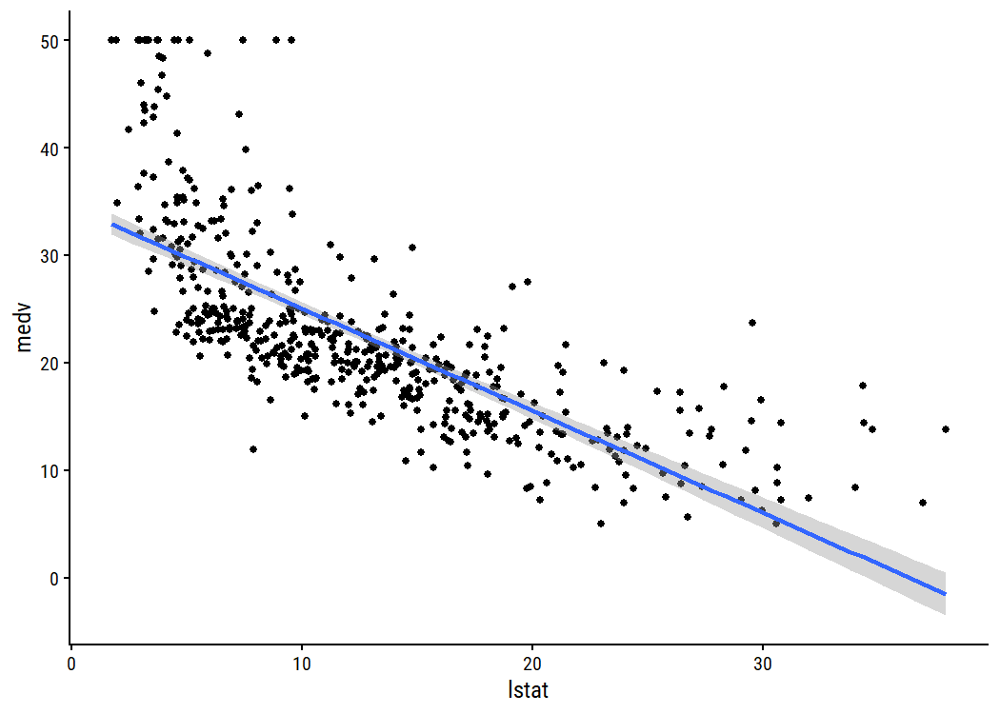<!-- -->

To display model diagnostics, we can call `plot()` on the model object
as we have before. I like the `performance` package because it uses
`ggplot2`:

``` r
performance::check_model(lm_medv_lstat)
```

    ## Registered S3 methods overwritten by 'parameters':
    ##   method                           from      
    ##   as.double.parameters_kurtosis    datawizard
    ##   as.double.parameters_skewness    datawizard
    ##   as.double.parameters_smoothness  datawizard
    ##   as.numeric.parameters_kurtosis   datawizard
    ##   as.numeric.parameters_skewness   datawizard
    ##   as.numeric.parameters_smoothness datawizard
    ##   print.parameters_distribution    datawizard
    ##   print.parameters_kurtosis        datawizard
    ##   print.parameters_skewness        datawizard
    ##   summary.parameters_kurtosis      datawizard
    ##   summary.parameters_skewness      datawizard

    ## Loading required namespace: qqplotr

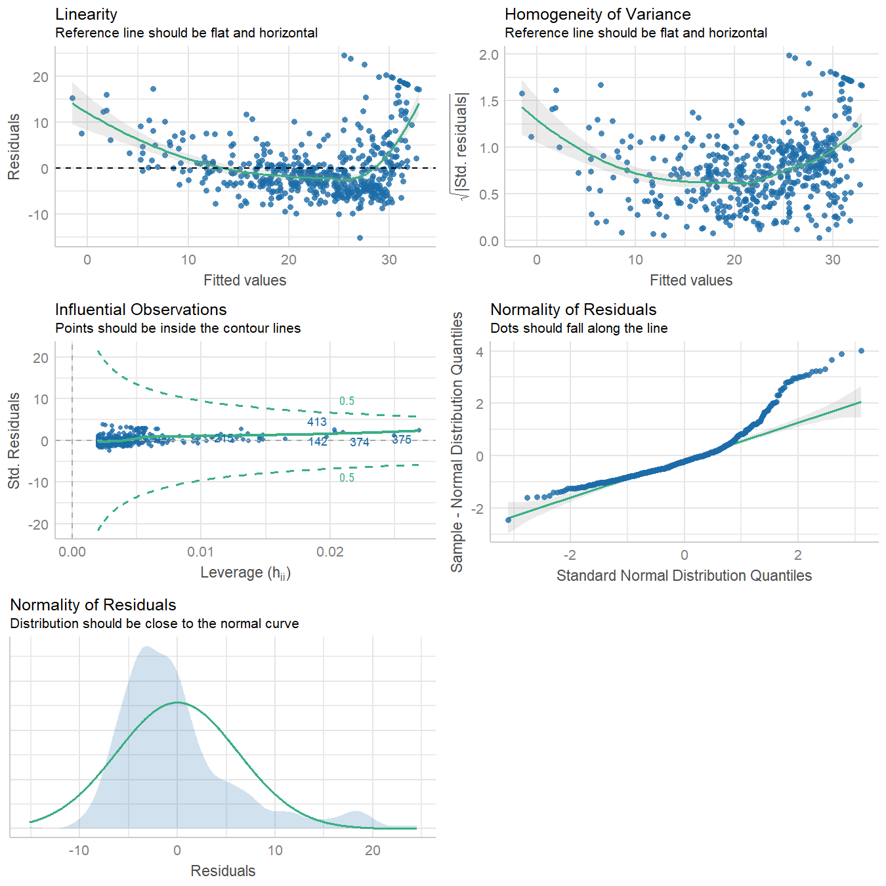<!-- -->

## 3.6.3 Multiple Linear Regression

Fit to all predictors and check VIF:

``` r
lm_medv_all <- lm(medv ~ ., data = boston)
performance::check_collinearity(lm_medv_all)
```

    ## # Check for Multicollinearity
    ## 
    ## Low Correlation
    ## 
    ##     Term  VIF Increased SE Tolerance
    ##     crim 1.77         1.33      0.57
    ##       zn 2.30         1.52      0.44
    ##    indus 3.99         2.00      0.25
    ##     chas 1.07         1.03      0.93
    ##      nox 4.37         2.09      0.23
    ##       rm 1.91         1.38      0.52
    ##      age 3.09         1.76      0.32
    ##      dis 3.95         1.99      0.25
    ##  ptratio 1.80         1.34      0.56
    ##    lstat 2.87         1.69      0.35
    ## 
    ## Moderate Correlation
    ## 
    ##  Term  VIF Increased SE Tolerance
    ##   rad 7.45         2.73      0.13
    ##   tax 9.00         3.00      0.11

The `rad` (accessibility to radial highways) and `tax` (property tax
rate) variables have moderate VIF.

## 3.6.4 Interaction Terms

## 3.6.5 Non-linear Transformations of the Predictors

Perform a regression of `medv` onto `lstat` and `lstat^2`, and compare
with `anova`:

``` r
lm_medv_lstat2 <- lm(medv ~ lstat + I(lstat^2), data = boston)
tbl_regression(lm_medv_lstat2)
```

<div id="bamgbctwbw" style="overflow-x:auto;overflow-y:auto;width:auto;height:auto;">
<style>html {
  font-family: -apple-system, BlinkMacSystemFont, 'Segoe UI', Roboto, Oxygen, Ubuntu, Cantarell, 'Helvetica Neue', 'Fira Sans', 'Droid Sans', Arial, sans-serif;
}

#bamgbctwbw .gt_table {
  display: table;
  border-collapse: collapse;
  margin-left: auto;
  margin-right: auto;
  color: #333333;
  font-size: 16px;
  font-weight: normal;
  font-style: normal;
  background-color: #FFFFFF;
  width: auto;
  border-top-style: solid;
  border-top-width: 2px;
  border-top-color: #A8A8A8;
  border-right-style: none;
  border-right-width: 2px;
  border-right-color: #D3D3D3;
  border-bottom-style: solid;
  border-bottom-width: 2px;
  border-bottom-color: #A8A8A8;
  border-left-style: none;
  border-left-width: 2px;
  border-left-color: #D3D3D3;
}

#bamgbctwbw .gt_heading {
  background-color: #FFFFFF;
  text-align: center;
  border-bottom-color: #FFFFFF;
  border-left-style: none;
  border-left-width: 1px;
  border-left-color: #D3D3D3;
  border-right-style: none;
  border-right-width: 1px;
  border-right-color: #D3D3D3;
}

#bamgbctwbw .gt_title {
  color: #333333;
  font-size: 125%;
  font-weight: initial;
  padding-top: 4px;
  padding-bottom: 4px;
  border-bottom-color: #FFFFFF;
  border-bottom-width: 0;
}

#bamgbctwbw .gt_subtitle {
  color: #333333;
  font-size: 85%;
  font-weight: initial;
  padding-top: 0;
  padding-bottom: 4px;
  border-top-color: #FFFFFF;
  border-top-width: 0;
}

#bamgbctwbw .gt_bottom_border {
  border-bottom-style: solid;
  border-bottom-width: 2px;
  border-bottom-color: #D3D3D3;
}

#bamgbctwbw .gt_col_headings {
  border-top-style: solid;
  border-top-width: 2px;
  border-top-color: #D3D3D3;
  border-bottom-style: solid;
  border-bottom-width: 2px;
  border-bottom-color: #D3D3D3;
  border-left-style: none;
  border-left-width: 1px;
  border-left-color: #D3D3D3;
  border-right-style: none;
  border-right-width: 1px;
  border-right-color: #D3D3D3;
}

#bamgbctwbw .gt_col_heading {
  color: #333333;
  background-color: #FFFFFF;
  font-size: 100%;
  font-weight: normal;
  text-transform: inherit;
  border-left-style: none;
  border-left-width: 1px;
  border-left-color: #D3D3D3;
  border-right-style: none;
  border-right-width: 1px;
  border-right-color: #D3D3D3;
  vertical-align: bottom;
  padding-top: 5px;
  padding-bottom: 6px;
  padding-left: 5px;
  padding-right: 5px;
  overflow-x: hidden;
}

#bamgbctwbw .gt_column_spanner_outer {
  color: #333333;
  background-color: #FFFFFF;
  font-size: 100%;
  font-weight: normal;
  text-transform: inherit;
  padding-top: 0;
  padding-bottom: 0;
  padding-left: 4px;
  padding-right: 4px;
}

#bamgbctwbw .gt_column_spanner_outer:first-child {
  padding-left: 0;
}

#bamgbctwbw .gt_column_spanner_outer:last-child {
  padding-right: 0;
}

#bamgbctwbw .gt_column_spanner {
  border-bottom-style: solid;
  border-bottom-width: 2px;
  border-bottom-color: #D3D3D3;
  vertical-align: bottom;
  padding-top: 5px;
  padding-bottom: 6px;
  overflow-x: hidden;
  display: inline-block;
  width: 100%;
}

#bamgbctwbw .gt_group_heading {
  padding: 8px;
  color: #333333;
  background-color: #FFFFFF;
  font-size: 100%;
  font-weight: initial;
  text-transform: inherit;
  border-top-style: solid;
  border-top-width: 2px;
  border-top-color: #D3D3D3;
  border-bottom-style: solid;
  border-bottom-width: 2px;
  border-bottom-color: #D3D3D3;
  border-left-style: none;
  border-left-width: 1px;
  border-left-color: #D3D3D3;
  border-right-style: none;
  border-right-width: 1px;
  border-right-color: #D3D3D3;
  vertical-align: middle;
}

#bamgbctwbw .gt_empty_group_heading {
  padding: 0.5px;
  color: #333333;
  background-color: #FFFFFF;
  font-size: 100%;
  font-weight: initial;
  border-top-style: solid;
  border-top-width: 2px;
  border-top-color: #D3D3D3;
  border-bottom-style: solid;
  border-bottom-width: 2px;
  border-bottom-color: #D3D3D3;
  vertical-align: middle;
}

#bamgbctwbw .gt_from_md > :first-child {
  margin-top: 0;
}

#bamgbctwbw .gt_from_md > :last-child {
  margin-bottom: 0;
}

#bamgbctwbw .gt_row {
  padding-top: 8px;
  padding-bottom: 8px;
  padding-left: 5px;
  padding-right: 5px;
  margin: 10px;
  border-top-style: solid;
  border-top-width: 1px;
  border-top-color: #D3D3D3;
  border-left-style: none;
  border-left-width: 1px;
  border-left-color: #D3D3D3;
  border-right-style: none;
  border-right-width: 1px;
  border-right-color: #D3D3D3;
  vertical-align: middle;
  overflow-x: hidden;
}

#bamgbctwbw .gt_stub {
  color: #333333;
  background-color: #FFFFFF;
  font-size: 100%;
  font-weight: initial;
  text-transform: inherit;
  border-right-style: solid;
  border-right-width: 2px;
  border-right-color: #D3D3D3;
  padding-left: 12px;
}

#bamgbctwbw .gt_summary_row {
  color: #333333;
  background-color: #FFFFFF;
  text-transform: inherit;
  padding-top: 8px;
  padding-bottom: 8px;
  padding-left: 5px;
  padding-right: 5px;
}

#bamgbctwbw .gt_first_summary_row {
  padding-top: 8px;
  padding-bottom: 8px;
  padding-left: 5px;
  padding-right: 5px;
  border-top-style: solid;
  border-top-width: 2px;
  border-top-color: #D3D3D3;
}

#bamgbctwbw .gt_grand_summary_row {
  color: #333333;
  background-color: #FFFFFF;
  text-transform: inherit;
  padding-top: 8px;
  padding-bottom: 8px;
  padding-left: 5px;
  padding-right: 5px;
}

#bamgbctwbw .gt_first_grand_summary_row {
  padding-top: 8px;
  padding-bottom: 8px;
  padding-left: 5px;
  padding-right: 5px;
  border-top-style: double;
  border-top-width: 6px;
  border-top-color: #D3D3D3;
}

#bamgbctwbw .gt_striped {
  background-color: rgba(128, 128, 128, 0.05);
}

#bamgbctwbw .gt_table_body {
  border-top-style: solid;
  border-top-width: 2px;
  border-top-color: #D3D3D3;
  border-bottom-style: solid;
  border-bottom-width: 2px;
  border-bottom-color: #D3D3D3;
}

#bamgbctwbw .gt_footnotes {
  color: #333333;
  background-color: #FFFFFF;
  border-bottom-style: none;
  border-bottom-width: 2px;
  border-bottom-color: #D3D3D3;
  border-left-style: none;
  border-left-width: 2px;
  border-left-color: #D3D3D3;
  border-right-style: none;
  border-right-width: 2px;
  border-right-color: #D3D3D3;
}

#bamgbctwbw .gt_footnote {
  margin: 0px;
  font-size: 90%;
  padding: 4px;
}

#bamgbctwbw .gt_sourcenotes {
  color: #333333;
  background-color: #FFFFFF;
  border-bottom-style: none;
  border-bottom-width: 2px;
  border-bottom-color: #D3D3D3;
  border-left-style: none;
  border-left-width: 2px;
  border-left-color: #D3D3D3;
  border-right-style: none;
  border-right-width: 2px;
  border-right-color: #D3D3D3;
}

#bamgbctwbw .gt_sourcenote {
  font-size: 90%;
  padding: 4px;
}

#bamgbctwbw .gt_left {
  text-align: left;
}

#bamgbctwbw .gt_center {
  text-align: center;
}

#bamgbctwbw .gt_right {
  text-align: right;
  font-variant-numeric: tabular-nums;
}

#bamgbctwbw .gt_font_normal {
  font-weight: normal;
}

#bamgbctwbw .gt_font_bold {
  font-weight: bold;
}

#bamgbctwbw .gt_font_italic {
  font-style: italic;
}

#bamgbctwbw .gt_super {
  font-size: 65%;
}

#bamgbctwbw .gt_footnote_marks {
  font-style: italic;
  font-weight: normal;
  font-size: 65%;
}
</style>
<table class="gt_table">
  
  <thead class="gt_col_headings">
    <tr>
      <th class="gt_col_heading gt_columns_bottom_border gt_left" rowspan="1" colspan="1"><strong>Characteristic</strong></th>
      <th class="gt_col_heading gt_columns_bottom_border gt_center" rowspan="1" colspan="1"><strong>Beta</strong></th>
      <th class="gt_col_heading gt_columns_bottom_border gt_center" rowspan="1" colspan="1"><strong>95% CI</strong><sup class="gt_footnote_marks">1</sup></th>
      <th class="gt_col_heading gt_columns_bottom_border gt_center" rowspan="1" colspan="1"><strong>p-value</strong></th>
    </tr>
  </thead>
  <tbody class="gt_table_body">
    <tr><td class="gt_row gt_left">lstat</td>
<td class="gt_row gt_center">-2.3</td>
<td class="gt_row gt_center">-2.6, -2.1</td>
<td class="gt_row gt_center"><0.001</td></tr>
    <tr><td class="gt_row gt_left">I(lstat^2)</td>
<td class="gt_row gt_center">0.04</td>
<td class="gt_row gt_center">0.04, 0.05</td>
<td class="gt_row gt_center"><0.001</td></tr>
  </tbody>
  
  <tfoot>
    <tr class="gt_footnotes">
      <td colspan="4">
        <p class="gt_footnote">
          <sup class="gt_footnote_marks">
            <em>1</em>
          </sup>
           
          CI = Confidence Interval
          <br />
        </p>
      </td>
    </tr>
  </tfoot>
</table>
</div>

``` r
anova(lm_medv_lstat, lm_medv_lstat2)
```

    ## Analysis of Variance Table
    ## 
    ## Model 1: medv ~ lstat
    ## Model 2: medv ~ lstat + I(lstat^2)
    ##   Res.Df   RSS Df Sum of Sq     F    Pr(>F)    
    ## 1    504 19472                                 
    ## 2    503 15347  1    4125.1 135.2 < 2.2e-16 ***
    ## ---
    ## Signif. codes:  0 '***' 0.001 '**' 0.01 '*' 0.05 '.' 0.1 ' ' 1

## 3.6.6 Qualitative Predictors

``` r
carseats <- ISLR2::Carseats
lm_sales <- lm(Sales ~ . + Income:Advertising + Price:Age,
               data = carseats)

contrasts(carseats$ShelveLoc)
```

    ##        Good Medium
    ## Bad       0      0
    ## Good      1      0
    ## Medium    0      1

# Reproducibility

<details>
<summary>
Reproducibility receipt
</summary>

``` r
Sys.time()
```

    ## [1] "2021-08-10 18:01:34 AST"

``` r
if ("git2r" %in% installed.packages()) {
  if (git2r::in_repository()) {
    git2r::repository()
  }
}
```

    ## Local:    main C:/Users/tdunn/Documents/learning/islr
    ## Remote:   main @ origin (https://github.com/taylordunn/islr)
    ## Head:     [ec2f218] 2021-08-07: First commit

``` r
sessioninfo::session_info()
```

    ## - Session info ---------------------------------------------------------------
    ##  setting  value                       
    ##  version  R version 4.1.0 (2021-05-18)
    ##  os       Windows 10 x64              
    ##  system   x86_64, mingw32             
    ##  ui       RTerm                       
    ##  language (EN)                        
    ##  collate  English_Canada.1252         
    ##  ctype    English_Canada.1252         
    ##  tz       America/Curacao             
    ##  date     2021-08-10                  
    ## 
    ## - Packages -------------------------------------------------------------------
    ##  package       * version date       lib source                           
    ##  assertthat      0.2.1   2019-03-21 [1] CRAN (R 4.1.0)                   
    ##  backports       1.2.1   2020-12-09 [1] CRAN (R 4.1.0)                   
    ##  bayestestR      0.10.5  2021-07-26 [1] CRAN (R 4.1.0)                   
    ##  broom         * 0.7.8   2021-06-24 [1] CRAN (R 4.1.0)                   
    ##  broom.helpers   1.3.0   2021-04-10 [1] CRAN (R 4.1.0)                   
    ##  cellranger      1.1.0   2016-07-27 [1] CRAN (R 4.1.0)                   
    ##  checkmate       2.0.0   2020-02-06 [1] CRAN (R 4.1.0)                   
    ##  cli             3.0.0   2021-06-30 [1] CRAN (R 4.1.0)                   
    ##  colorspace      2.0-2   2021-06-24 [1] CRAN (R 4.1.0)                   
    ##  commonmark      1.7     2018-12-01 [1] CRAN (R 4.1.0)                   
    ##  crayon          1.4.1   2021-02-08 [1] CRAN (R 4.1.0)                   
    ##  datawizard      0.1.0   2021-06-18 [1] CRAN (R 4.1.0)                   
    ##  DBI             1.1.1   2021-01-15 [1] CRAN (R 4.1.0)                   
    ##  dbplyr          2.1.1   2021-04-06 [1] CRAN (R 4.1.0)                   
    ##  DEoptimR        1.0-9   2021-05-24 [1] CRAN (R 4.1.0)                   
    ##  digest          0.6.27  2020-10-24 [1] CRAN (R 4.1.0)                   
    ##  dplyr         * 1.0.7   2021-06-18 [1] CRAN (R 4.1.0)                   
    ##  dunnr         * 0.2.0   2021-08-06 [1] Github (taylordunn/dunnr@0a41433)
    ##  effectsize      0.4.5   2021-05-25 [1] CRAN (R 4.1.0)                   
    ##  ellipsis        0.3.2   2021-04-29 [1] CRAN (R 4.1.0)                   
    ##  evaluate        0.14    2019-05-28 [1] CRAN (R 4.1.0)                   
    ##  extrafont       0.17    2014-12-08 [1] CRAN (R 4.1.0)                   
    ##  extrafontdb     1.0     2012-06-11 [1] CRAN (R 4.1.0)                   
    ##  fansi           0.5.0   2021-05-25 [1] CRAN (R 4.1.0)                   
    ##  farver          2.1.0   2021-02-28 [1] CRAN (R 4.1.0)                   
    ##  forcats       * 0.5.1   2021-01-27 [1] CRAN (R 4.1.0)                   
    ##  fs              1.5.0   2020-07-31 [1] CRAN (R 4.1.0)                   
    ##  generics        0.1.0   2020-10-31 [1] CRAN (R 4.1.0)                   
    ##  ggplot2       * 3.3.5   2021-06-25 [1] CRAN (R 4.1.0)                   
    ##  ggrepel         0.9.1   2021-01-15 [1] CRAN (R 4.1.0)                   
    ##  ggridges        0.5.3   2021-01-08 [1] CRAN (R 4.1.0)                   
    ##  git2r           0.28.0  2021-01-10 [1] CRAN (R 4.1.0)                   
    ##  glue          * 1.4.2   2020-08-27 [1] CRAN (R 4.1.0)                   
    ##  gridExtra       2.3     2017-09-09 [1] CRAN (R 4.1.0)                   
    ##  gt            * 0.3.0   2021-05-12 [1] CRAN (R 4.1.0)                   
    ##  gtable          0.3.0   2019-03-25 [1] CRAN (R 4.1.0)                   
    ##  gtsummary     * 1.4.2   2021-07-13 [1] CRAN (R 4.1.0)                   
    ##  haven           2.4.1   2021-04-23 [1] CRAN (R 4.1.0)                   
    ##  here          * 1.0.1   2020-12-13 [1] CRAN (R 4.1.0)                   
    ##  highr           0.9     2021-04-16 [1] CRAN (R 4.1.0)                   
    ##  hms             1.1.0   2021-05-17 [1] CRAN (R 4.1.0)                   
    ##  htmltools       0.5.1.1 2021-01-22 [1] CRAN (R 4.1.0)                   
    ##  httr            1.4.2   2020-07-20 [1] CRAN (R 4.1.0)                   
    ##  insight         0.14.2  2021-06-22 [1] CRAN (R 4.1.0)                   
    ##  ISLR2           1.0     2021-07-22 [1] CRAN (R 4.1.0)                   
    ##  jsonlite        1.7.2   2020-12-09 [1] CRAN (R 4.1.0)                   
    ##  knitr           1.33    2021-04-24 [1] CRAN (R 4.1.0)                   
    ##  labeling        0.4.2   2020-10-20 [1] CRAN (R 4.1.0)                   
    ##  labelled        2.8.0   2021-03-08 [1] CRAN (R 4.1.0)                   
    ##  lattice         0.20-44 2021-05-02 [2] CRAN (R 4.1.0)                   
    ##  lifecycle       1.0.0   2021-02-15 [1] CRAN (R 4.1.0)                   
    ##  lubridate       1.7.10  2021-02-26 [1] CRAN (R 4.1.0)                   
    ##  magrittr        2.0.1   2020-11-17 [1] CRAN (R 4.1.0)                   
    ##  MASS            7.3-54  2021-05-03 [2] CRAN (R 4.1.0)                   
    ##  Matrix          1.3-3   2021-05-04 [2] CRAN (R 4.1.0)                   
    ##  mgcv            1.8-35  2021-04-18 [2] CRAN (R 4.1.0)                   
    ##  modelr          0.1.8   2020-05-19 [1] CRAN (R 4.1.0)                   
    ##  munsell         0.5.0   2018-06-12 [1] CRAN (R 4.1.0)                   
    ##  nlme            3.1-152 2021-02-04 [2] CRAN (R 4.1.0)                   
    ##  parameters      0.14.0  2021-05-29 [1] CRAN (R 4.1.0)                   
    ##  patchwork     * 1.1.1   2020-12-17 [1] CRAN (R 4.1.0)                   
    ##  performance     0.7.3   2021-07-21 [1] CRAN (R 4.1.0)                   
    ##  pillar          1.6.2   2021-07-29 [1] CRAN (R 4.1.0)                   
    ##  pkgconfig       2.0.3   2019-09-22 [1] CRAN (R 4.1.0)                   
    ##  plyr            1.8.6   2020-03-03 [1] CRAN (R 4.1.0)                   
    ##  purrr         * 0.3.4   2020-04-17 [1] CRAN (R 4.1.0)                   
    ##  qqplotr         0.0.5   2021-04-23 [1] CRAN (R 4.1.0)                   
    ##  R6              2.5.0   2020-10-28 [1] CRAN (R 4.1.0)                   
    ##  Rcpp            1.0.7   2021-07-07 [1] CRAN (R 4.1.0)                   
    ##  readr         * 1.4.0   2020-10-05 [1] CRAN (R 4.1.0)                   
    ##  readxl          1.3.1   2019-03-13 [1] CRAN (R 4.1.0)                   
    ##  reprex          2.0.0   2021-04-02 [1] CRAN (R 4.1.0)                   
    ##  rlang           0.4.11  2021-04-30 [1] CRAN (R 4.1.0)                   
    ##  rmarkdown       2.9     2021-06-15 [1] CRAN (R 4.1.0)                   
    ##  robustbase      0.93-8  2021-06-02 [1] CRAN (R 4.1.0)                   
    ##  rprojroot       2.0.2   2020-11-15 [1] CRAN (R 4.1.0)                   
    ##  rstudioapi      0.13    2020-11-12 [1] CRAN (R 4.1.0)                   
    ##  Rttf2pt1        1.3.8   2020-01-10 [1] CRAN (R 4.1.0)                   
    ##  rvest           1.0.0   2021-03-09 [1] CRAN (R 4.1.0)                   
    ##  sass            0.4.0   2021-05-12 [1] CRAN (R 4.1.0)                   
    ##  scales          1.1.1   2020-05-11 [1] CRAN (R 4.1.0)                   
    ##  see             0.6.4   2021-05-29 [1] CRAN (R 4.1.0)                   
    ##  sessioninfo     1.1.1   2018-11-05 [1] CRAN (R 4.1.0)                   
    ##  stringi         1.6.2   2021-05-17 [1] CRAN (R 4.1.0)                   
    ##  stringr       * 1.4.0   2019-02-10 [1] CRAN (R 4.1.0)                   
    ##  survival        3.2-11  2021-04-26 [2] CRAN (R 4.1.0)                   
    ##  tibble        * 3.1.3   2021-07-23 [1] CRAN (R 4.1.0)                   
    ##  tidyr         * 1.1.3   2021-03-03 [1] CRAN (R 4.1.0)                   
    ##  tidyselect      1.1.1   2021-04-30 [1] CRAN (R 4.1.0)                   
    ##  tidyverse     * 1.3.1   2021-04-15 [1] CRAN (R 4.1.0)                   
    ##  utf8            1.2.2   2021-07-24 [1] CRAN (R 4.1.0)                   
    ##  vctrs           0.3.8   2021-04-29 [1] CRAN (R 4.1.0)                   
    ##  withr           2.4.2   2021-04-18 [1] CRAN (R 4.1.0)                   
    ##  xfun            0.24    2021-06-15 [1] CRAN (R 4.1.0)                   
    ##  xml2            1.3.2   2020-04-23 [1] CRAN (R 4.1.0)                   
    ##  yaml            2.2.1   2020-02-01 [1] CRAN (R 4.1.0)                   
    ## 
    ## [1] C:/Users/tdunn/Documents/R/win-library/4.1
    ## [2] C:/Program Files/R/R-4.1.0/library

</details>

# References

<div id="refs" class="references csl-bib-body hanging-indent"
line-spacing="2">

<div id="ref-James2021" class="csl-entry">

James, G., Witten, D., Hastie, T., & Tibshirani, R. (2021). *An
introduction to statistical learning with applications in r* (2nd ed.).
Springer. https://doi.org/<https://doi.org/10.1007/978-1-0716-1418-1_1>

</div>

</div>
